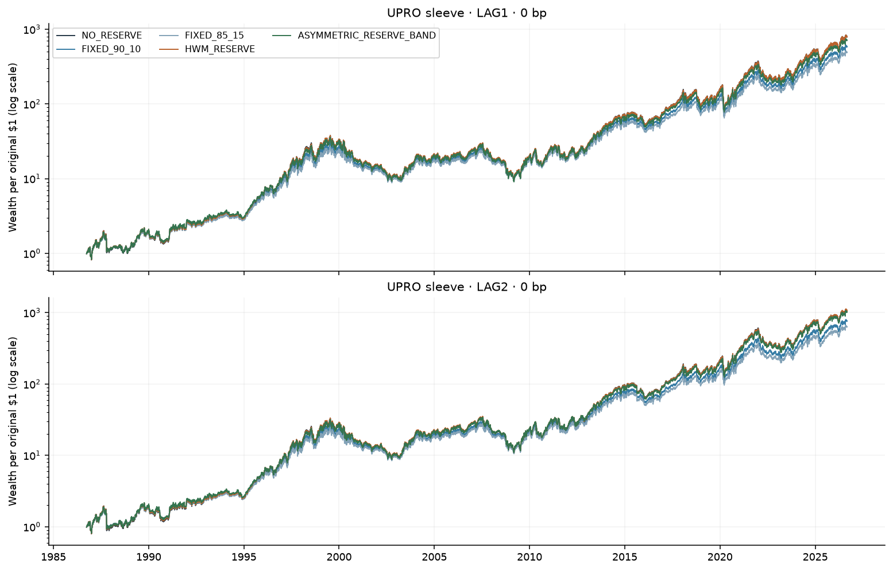
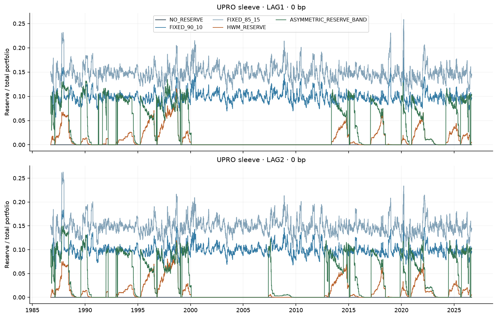
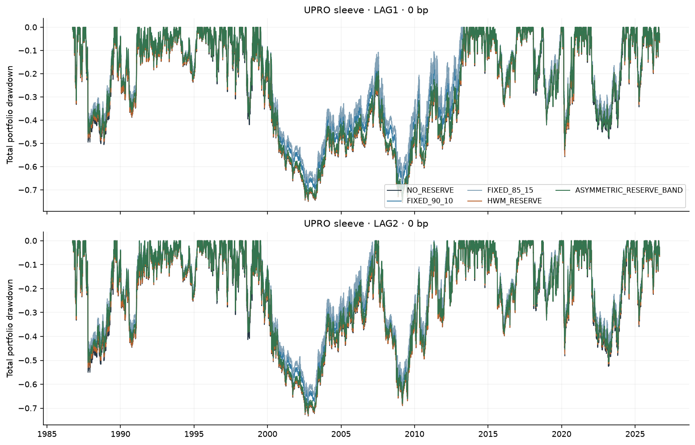
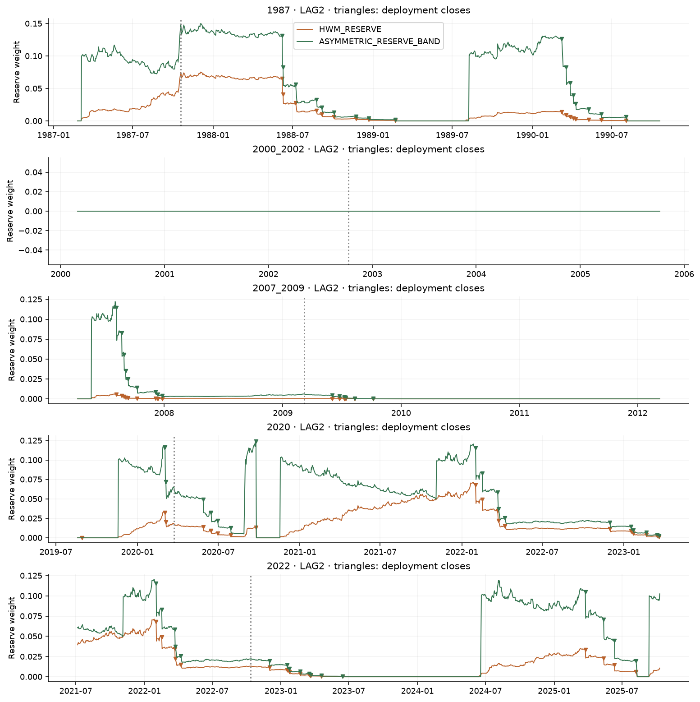
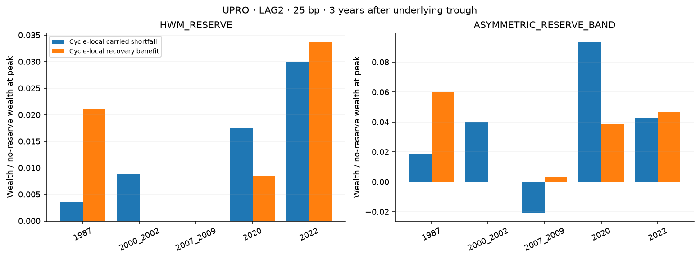

# Capital reserve / dry-powder experiment

Frozen sample: **1986-09-26–2026-09-02**. Original daily histories, funding, fees, T-bill yield accrual, TR-SMA construction and common falsification dates are reused unchanged.

## Main comparison

| series | lag | cost_bps | cagr | max_drawdown | terminal_multiple | average_reserve_weight | average_effective_equity_exposure |
| --- | --- | --- | --- | --- | --- | --- | --- |
| NO_RESERVE | LAG1 | 0 | 18.20% | -75.46% | 795.5022 | 0.00% | 2.5149 |
| FIXED_90_10 | LAG1 | 0 | 17.30% | -70.32% | 584.4256 | 9.85% | 2.2713 |
| FIXED_85_15 | LAG1 | 0 | 16.79% | -67.72% | 491.0818 | 14.78% | 2.1491 |
| HWM_RESERVE | LAG1 | 0 | 18.20% | -75.28% | 795.5328 | 1.19% | 2.4837 |
| ASYMMETRIC_RESERVE_BAND | LAG1 | 0 | 17.88% | -74.72% | 713.6567 | 3.57% | 2.4186 |
| NO_RESERVE | LAG1 | 25 | 16.29% | -80.36% | 413.9133 | 0.00% | 2.5149 |
| FIXED_90_10 | LAG1 | 25 | 15.59% | -75.04% | 325.1848 | 9.85% | 2.2713 |
| FIXED_85_15 | LAG1 | 25 | 15.18% | -71.98% | 282.4887 | 14.78% | 2.1491 |
| HWM_RESERVE | LAG1 | 25 | 16.33% | -80.21% | 419.8653 | 1.07% | 2.4873 |
| ASYMMETRIC_RESERVE_BAND | LAG1 | 25 | 15.98% | -79.76% | 372.4929 | 3.57% | 2.4186 |
| NO_RESERVE | LAG2 | 0 | 19.08% | -73.29% | 1066.7310 | 0.00% | 2.5147 |
| FIXED_90_10 | LAG2 | 0 | 18.09% | -68.59% | 764.5124 | 9.91% | 2.2700 |
| FIXED_85_15 | LAG2 | 0 | 17.54% | -66.00% | 634.1415 | 14.86% | 2.1473 |
| HWM_RESERVE | LAG2 | 0 | 19.09% | -73.09% | 1070.5076 | 1.24% | 2.4823 |
| ASYMMETRIC_RESERVE_BAND | LAG2 | 0 | 18.95% | -72.45% | 1021.2192 | 3.71% | 2.4158 |
| NO_RESERVE | LAG2 | 25 | 17.14% | -75.41% | 555.0383 | 0.00% | 2.5147 |
| FIXED_90_10 | LAG2 | 25 | 16.36% | -70.82% | 425.1604 | 9.91% | 2.2700 |
| FIXED_85_15 | LAG2 | 25 | 15.92% | -68.26% | 364.5062 | 14.86% | 2.1473 |
| HWM_RESERVE | LAG2 | 25 | 17.18% | -75.22% | 561.4664 | 1.16% | 2.4847 |
| ASYMMETRIC_RESERVE_BAND | LAG2 | 25 | 17.03% | -74.61% | 533.7722 | 3.71% | 2.4158 |

NO_RESERVE means `UPRO_SMA_TO_SP500` or `SSO_SMA_TO_SP500`, as identified by the fund column. `FIXED_90_10` and `FIXED_85_15` are aliases for `STATIC_RESERVE_10` and `STATIC_RESERVE_15`. HWM_RESERVE and ASYMMETRIC_RESERVE_BAND use staged recovery deployment. HWM_DRAWDOWN and BAND_DRAWDOWN are separate deployment sensitivities, never combined with staging.

## Equal-average-reserve and exposure controls

| series | average_reserve | rounded_fixed_reserve | dynamic_cagr | fixed_cagr | dynamic_to_fixed_terminal_ratio | dynamic_average_effective_exposure | constant_leverage_cagr |
| --- | --- | --- | --- | --- | --- | --- | --- |
| HWM_RESERVE | 0.0116 | 0.0000 | 0.1718 | 0.1714 | 1.0116 | 2.4847 | 0.1443 |
| ASYMMETRIC_RESERVE_BAND | 0.0371 | 0.0500 | 0.1703 | 0.1677 | 1.0912 | 2.4158 | 0.1444 |
| HWM_DRAWDOWN | 0.0681 | 0.0500 | 0.1696 | 0.1677 | 1.0649 | 2.3514 | 0.1443 |
| BAND_DRAWDOWN | 0.0828 | 0.1000 | 0.1705 | 0.1636 | 1.2648 | 2.3166 | 0.1441 |

Matching uses the full-sample mean reserve, rounded half-up to 0/5/10/15/20% etc. This is an ex-post diagnostic, not a deployable forecast or parameter optimization. The fixed target and its realized mean differ through drift. Equal cash allocation is not equal risk: state-dependent exposure, volatility and drawdowns remain different. Constant leverage uses the dynamic policy’s mean effective exposure with the original inferred funding+spread and the same fund fee; no core return history is rebuilt. Its daily reset is synthetic and incurs no additional investor state-switch fee.

## Assessment: no reserve is the best-supported growth architecture

**The complex reserve rules do not establish robust full-cycle value.** Keep the no-reserve SMA rule as the parsimonious growth baseline. A fixed reserve is an interpretable choice when deliberately accepting lower exposure and smaller drawdowns, but that is a different objective from demonstrating superior geometric wealth. Staging is a deployment mechanism, not a separately funded reserve architecture.

At **UPRO / LAG2 / 25 bp**, HWM CAGR is **17.18%** and band CAGR **17.03%**, versus **17.14%** without reserve: improvements of only **0.03 / -0.11 percentage points/year**. The favorable headline does not persist across execution assumptions, the lower-leverage sleeve and distinct historical cycles.

1. **Does a reserve improve long-run wealth? Only conditionally.** UPRO LAG2/25 bp terminal wealth rises 1.2% with HWM and -3.8% with the band. For SSO under the same assumptions, CAGR is 13.63% / 13.32%, versus 13.66% without reserve. LAG1/zero-cost dynamic reserve rules also fail to improve on no reserve.

2. **Is it more than fixed cash? Some UPRO timing value appears, but it is not robust.** The exact-average-target diagnostic below supplements the prespecified 5-point rounding. Exact matching sets the fixed target to the observed dynamic mean, without fitting returns; drift means realized average weights remain approximate. Neither comparison is exact risk matching.

| series | dynamic_cagr | exact_average_fixed_cagr | dynamic_to_exact_average_fixed_terminal_ratio |
| --- | --- | --- | --- |
| HWM_RESERVE | 0.1718 | 0.1706 | 1.0403 |
| ASYMMETRIC_RESERVE_BAND | 0.1703 | 0.1687 | 1.0547 |
| HWM_DRAWDOWN | 0.1696 | 0.1663 | 1.1185 |
| BAND_DRAWDOWN | 0.1705 | 0.1651 | 1.2033 |

3. **Does HWM retain bull upside? Yes, mostly because it holds very little reserve.** It averages only 1.16% bills, versus 9.91% for fixed 90/10. The gain cap is rarely binding, and long underwater periods prevent new harvesting. HWM therefore preserves upside at the cost of often lacking meaningful dry powder.

4. **Are recoveries shorter? Mainly in 1987.** The own-HWM recovery dates improve sharply there, but by only days to weeks in most later episodes. Both staged architectures have zero bills at the 2002 trough, and HWM also has zero at the 2009 trough. A wealth ratio above one in those episodes can simply carry forward an earlier gain.

5. **Is staging better than drawdown buying? No stable dominance.** UPRO LAG2/25 bp staged versus drawdown HWM CAGR is 17.18% versus 16.96%; band is 17.03% versus 17.05%. SSO band drawdown deployment beats its staged version, while both lag no reserve. Hold-only controls confirm that leaving accumulated cash unused is costly; that does not prove the particular deployment timing is optimal.

6. **Does it reconstruct risk capacity? When cash survives, yes; reliably across crashes, no.** Dry-powder ratios and marked deployed-lot wealth quantify the capacity, with adverse-state deployment limited to 1×. Repeated favorable episodes can spend the reserve before the eventual trough. The large 1987 band effect also partly comes from its initial 10% reserve, whereas HWM starts with zero.

7. **What bull CAGR is sacrificed?** The table summarizes positive-return favorable episodes lasting at least 60 sessions. Medians are descriptive, not an estimate of a permanent annual penalty. Zero median loss for a dynamic rule often means the reserve was empty; occasional relative gains within favorable episodes reflect daily compounding and lower exposure. The CSV retains every eligible episode and links it to the next named stress cycle. Those repeated cycle references must not be summed.

| series | episodes | median_no_reserve_cagr | median_reserve_cagr | median_cagr_sacrifice_pp | cumulative_log_growth_foregone |
| --- | --- | --- | --- | --- | --- |
| NO_RESERVE | 27 | 0.3838 | 0.3838 | 0.0000 | 0.0000 |
| FIXED_90_10 | 27 | 0.3838 | 0.3502 | 3.2628 | 0.7011 |
| FIXED_85_15 | 27 | 0.3838 | 0.3333 | 4.9160 | 1.0645 |
| HWM_RESERVE | 27 | 0.3838 | 0.3842 | 0.0000 | -0.0054 |
| ASYMMETRIC_RESERVE_BAND | 27 | 0.3838 | 0.4014 | 0.0000 | 0.0568 |
| HWM_DRAWDOWN | 27 | 0.3838 | 0.3708 | 1.4605 | 0.4319 |
| BAND_DRAWDOWN | 27 | 0.3838 | 0.3522 | 1.9788 | 0.5058 |

8. **Does recovery repay the cost? Generally not in the later staged-reserve cycles.** The following local-cycle accounting equalizes starting wealth at the previous named crash’s underlying recovery, then includes all accumulation up to the next peak. The first cycle starts at sample entry. It removes inherited dollar advantages without resetting reserve policy state. At three years, HWM repays the 1987 shortfall but not the 2000, 2020 or 2022 shortfalls; 2008 has essentially no local reserve activity. The band also fails to repay 2000, 2020 and 2022. Near-zero costs and negative costs have undefined payback ratios.

| series | event | cycle_local_recovery_multiplier | cycle_local_reserve_payback_ratio | dry_powder_ratio | reserve_recovery_days | no_reserve_recovery_days |
| --- | --- | --- | --- | --- | --- | --- |
| HWM_RESERVE | 1987 | 1.0292 | 5.8093 | 0.0809 | 658 | 679 |
| HWM_RESERVE | 2000_2002 | 0.9907 | 0.0000 | 0.0000 | 3836 | 3836 |
| HWM_RESERVE | 2007_2009 | 1.0000 | nan | 0.0000 | 1493 | 1493 |
| HWM_RESERVE | 2020 | 0.9920 | 0.4882 | 0.0166 | 158 | 162 |
| HWM_RESERVE | 2022 | 1.0029 | 1.1256 | 0.0134 | 630 | 632 |
| ASYMMETRIC_RESERVE_BAND | 1987 | 1.0689 | 3.2034 | 0.1754 | 651 | 679 |
| ASYMMETRIC_RESERVE_BAND | 2000_2002 | 0.9581 | -0.0000 | 0.0000 | 3806 | 3836 |
| ASYMMETRIC_RESERVE_BAND | 2007_2009 | 1.0262 | nan | 0.0062 | 1463 | 1493 |
| ASYMMETRIC_RESERVE_BAND | 2020 | 0.9511 | 0.4153 | 0.0704 | 156 | 162 |
| ASYMMETRIC_RESERVE_BAND | 2022 | 1.0029 | 1.0844 | 0.0227 | 615 | 632 |

9. **Are results consistent across crises? No.** 1987 supplies much of the surviving staged reserve advantage. The 2010-onward comparison loses relative wealth for both staged rules:

| series | period | terminal_ratio_vs_no_reserve |
| --- | --- | --- |
| HWM_RESERVE | 1987_1999 | 1.0118 |
| HWM_RESERVE | 2000_2009 | 1.0009 |
| HWM_RESERVE | 2010_2019 | 0.9861 |
| HWM_RESERVE | 2020_latest | 1.0092 |
| HWM_RESERVE | 2010_latest | 0.9951 |
| ASYMMETRIC_RESERVE_BAND | 1987_1999 | 0.9679 |
| ASYMMETRIC_RESERVE_BAND | 2000_2009 | 1.0299 |
| ASYMMETRIC_RESERVE_BAND | 2010_2019 | 0.9269 |
| ASYMMETRIC_RESERVE_BAND | 2020_latest | 1.0206 |
| ASYMMETRIC_RESERVE_BAND | 2010_latest | 0.9461 |

10. **Do gains survive execution delay and costs? The small UPRO LAG2 gain does survive 10–25 bp, but it is not invariant to lag or leverage.** The complete grid includes 50 bp and reports both direct charged-cost drag and endogenous changes in policy decisions.

11. **Does complexity beat simple controls materially? Not with sufficient robustness.** The prespecified HWM cap/harvest grid has the following LAG2/25-bp CAGR ranges; similar cap results mostly mean caps are inactive, rather than demonstrating a universal robust optimum.

| fund | min | max |
| --- | --- | --- |
| SSO | 0.1361 | 0.1364 |
| UPRO | 0.1716 | 0.1719 |

12. **Conclusion: the added complexity is not justified by this experiment.** No reserve is the best-supported baseline for the stated geometric-growth objective. Fixed reserve is the clearer alternative for an explicit capital-preservation objective. Do not market either as free dry powder, and do not infer future performance from five overlapping historical crisis narratives.

## Fresh-investor rolling cohorts

These monthly cohorts start with fresh $1, each rule’s prescribed initial reserve, new HWM and confirmation state. Underlying SMA/drawdown history remains observable before entry. They check whether the inherited-policy results depend on a reserve built or spent before the investor starts. Both funds/lags and 0/25 bp are included in the CSV; the important LAG2/25-bp results follow. Cohorts overlap extensively. Use the median of paired wealth ratios, not the ratio of separately calculated medians. Drawdown deployment improves some 20-year outcomes, but its UPRO 30-year paired median is approximately break-even at LAG2/25 bp and lower under the other lag/cost combinations.

| series | fund | horizon_years | cohorts | min_cagr | median_cagr | min_terminal_multiple | median_terminal_multiple | median_ratio_vs_no_reserve |
| --- | --- | --- | --- | --- | --- | --- | --- | --- |
| ASYMMETRIC_RESERVE_BAND | SSO | 20 | 240 | 0.0536 | 0.1028 | 2.8406 | 7.0815 | 0.9372 |
| ASYMMETRIC_RESERVE_BAND | SSO | 30 | 120 | 0.1043 | 0.1216 | 19.6230 | 31.2966 | 0.8819 |
| ASYMMETRIC_RESERVE_BAND | UPRO | 20 | 240 | 0.0666 | 0.1332 | 3.6336 | 12.2021 | 0.9610 |
| ASYMMETRIC_RESERVE_BAND | UPRO | 30 | 120 | 0.1310 | 0.1591 | 40.1445 | 83.9234 | 0.9038 |
| BAND_DRAWDOWN | SSO | 20 | 240 | 0.0579 | 0.1069 | 3.0844 | 7.6302 | 1.0086 |
| BAND_DRAWDOWN | SSO | 30 | 120 | 0.1071 | 0.1235 | 21.1536 | 32.9392 | 0.9337 |
| BAND_DRAWDOWN | UPRO | 20 | 240 | 0.0774 | 0.1372 | 4.4385 | 13.0827 | 1.0408 |
| BAND_DRAWDOWN | UPRO | 30 | 120 | 0.1324 | 0.1627 | 41.7110 | 92.0994 | 0.9789 |
| FIXED_85_15 | SSO | 20 | 240 | 0.0523 | 0.0989 | 2.7707 | 6.6010 | 0.8804 |
| FIXED_85_15 | SSO | 30 | 120 | 0.0994 | 0.1151 | 17.1477 | 26.2615 | 0.7415 |
| FIXED_85_15 | UPRO | 20 | 240 | 0.0676 | 0.1276 | 3.6991 | 11.0496 | 0.8813 |
| FIXED_85_15 | UPRO | 30 | 120 | 0.1242 | 0.1499 | 33.4883 | 66.1307 | 0.7219 |
| FIXED_90_10 | SSO | 20 | 240 | 0.0530 | 0.1016 | 2.8102 | 6.9252 | 0.9214 |
| FIXED_90_10 | SSO | 30 | 120 | 0.1019 | 0.1189 | 18.3893 | 29.1094 | 0.8234 |
| FIXED_90_10 | UPRO | 20 | 240 | 0.0681 | 0.1308 | 3.7312 | 11.6797 | 0.9246 |
| FIXED_90_10 | UPRO | 30 | 120 | 0.1268 | 0.1545 | 35.9120 | 74.3989 | 0.8116 |
| HWM_DRAWDOWN | SSO | 20 | 240 | 0.0538 | 0.1079 | 2.8511 | 7.7620 | 1.0020 |
| HWM_DRAWDOWN | SSO | 30 | 120 | 0.1061 | 0.1253 | 20.6234 | 34.5145 | 0.9795 |
| HWM_DRAWDOWN | UPRO | 20 | 240 | 0.0677 | 0.1375 | 3.7040 | 13.1526 | 1.0220 |
| HWM_DRAWDOWN | UPRO | 30 | 120 | 0.1316 | 0.1623 | 40.7748 | 91.1656 | 0.9969 |
| HWM_RESERVE | SSO | 20 | 240 | 0.0537 | 0.1061 | 2.8471 | 7.5157 | 0.9889 |
| HWM_RESERVE | SSO | 30 | 120 | 0.1057 | 0.1253 | 20.3946 | 34.4979 | 0.9765 |
| HWM_RESERVE | UPRO | 20 | 240 | 0.0677 | 0.1349 | 3.7052 | 12.5740 | 0.9894 |
| HWM_RESERVE | UPRO | 30 | 120 | 0.1301 | 0.1618 | 39.1902 | 90.0530 | 0.9785 |
| NO_RESERVE | SSO | 20 | 240 | 0.0540 | 0.1069 | 2.8642 | 7.6262 | 1.0000 |
| NO_RESERVE | SSO | 30 | 120 | 0.1065 | 0.1261 | 20.8541 | 35.2762 | 1.0000 |
| NO_RESERVE | UPRO | 20 | 240 | 0.0681 | 0.1358 | 3.7350 | 12.7749 | 1.0000 |
| NO_RESERVE | UPRO | 30 | 120 | 0.1310 | 0.1625 | 40.1515 | 91.6354 | 1.0000 |

## Accounting and implementation conventions

- All policies start with $1. HWM starts with no bills, fixed policies start at their target, and the band starts with 10% bills. Initial allocations are not charged as transitions, matching the existing framework. There are no contributions, withdrawals, taxes or external reserve funding.

- A new total-portfolio high advances the HWM immediately when recognized, even when the cap blocks a transfer. Gain-harvest orders use only the lag-eligible observed close, are executed within current available capital, and are capped using execution-close total wealth. The cap limits accumulation; passive reserve weight can exceed it after risky losses.

- The band’s 20% upper boundary is a drift/reference boundary, not a mandatory crash sale of bills: no forced buying of leveraged equities below SMA. Above 5%, no ordinary replenishment occurs. Below 5%, favorable-state rebuilding targets 10%. After deployment, replenishment requires a newly observed all-history high in the unreserved risky sleeve, before investor switching charges, after that deployment. At most one reserve transfer occurs per execution close; deployment takes precedence.

- Staging starts on an executed unfavorable→favorable transition, not an initially favorable sample entry. First tranche is one-third of current bill units; second is another third of episode-entry units after 20 completed favorable sessions; all remaining bills, including new harvests, follow 60 completed sessions. Interest stays with each tranche. A new episode re-splits remaining bills and resets confirmation. A continuing adverse signal never causes a staged purchase.

- Drawdown uses the existing 1× S&P total-return index from its all-history high, lagged like the SMA. The first threshold snapshots bill units; 20/25/25/30% are deployed once per underlying drawdown episode. Gapped thresholds execute together. Thresholds reset only after the underlying regains its high. Additional later reserve accumulation is not part of the original snapshotted pool. All adverse-state buys follow 1×, favorable buys follow the fund.

- LAG1 orders from close t affect return ending t+1; LAG2 affects t+2. HWM/band observations and drawdown triggers use the same lag. Fixed calendar rebalances receive the same extra session delay. Staging counts executed allocation states.

- Costs use half-L1 turnover across actual old/new risky assets and bills. A full risky switch plus reserve deployment charges the union of those trades once, not their sum. Costs are paid proportionally from post-transfer holdings. Category trade counts may overlap; total charged transition days and net turnover do not. Direct cost drag holds the realized decision path fixed; zero-cost-versus-cost total drag also includes changes in future decisions.

- Exposure uses beginning-of-return, post-trade weights. Fraction at exactly 1×/2×/3× means total portfolio exposure, with separate sleeve-state fractions. A partly reserved 3× sleeve generally gives less than 3× total exposure.

- Stress dates use a common underlying trough and its preceding all-history high. All wealth is measured per original $1, including accumulation before the crash. Deployed-lot marking removes subsequent proportional harvesting and includes later costs; the cash-only alternative is gross interest carry. Remaining marked lots are not an exhaustive causal decomposition.

- Rolling minima use exact calendar anniversaries with first trading close on/after anniversary. The standard rolling CSV inherits policy state, consistent with purchasing units of a running strategy. Fresh-investor state-reset cohorts are reported separately when generated. Overlapping cohorts are descriptive, not probabilities.

## Figures











## Reproduce

```bash
PYTHONPATH=src python -m unittest discover -s tests -v
PYTHONPATH=src python -m letf.capital_reserve --offline
```

Inputs restore from the existing verified bundle; the manifest records hashes, parameters and runtime versions. Core return data and earlier reports are unchanged. Synthetic pre-inception LETF returns, early index proxies, idealized closing executions, gross 1× returns and the original financing assumptions remain limitations. Cash accrual is not a traded bill fund with mark-to-market risk.
