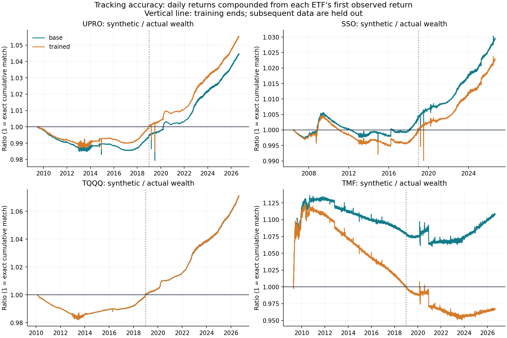

# Initial reconstruction results

Data through **2026-09-02**. This report is generated by `python -m letf.pipeline`.
All returns are nominal USD total returns before investor taxes and trading costs.

## Unfitted baseline vs observed ETF returns

The baseline fixes funding at lagged DFF plus 50 basis points per borrowed dollar, with
constant current expense ratios. No parameter was tuned to these results.
UPRO/SSO/TQQQ use official split-adjusted NAV plus Yahoo distribution events;
TMF uses Yahoo adjusted market close. The NAV construction is a hybrid-source estimate,
not an independently verified official total-return file.

| fund | daily_correlation | daily_rmse_bps | cagr_gap_pp | terminal_relative_error |
| --- | --- | --- | --- | --- |
| UPRO | 0.9998 | 5.8531 | 0.3384 | 0.0445 |
| SSO | 0.9999 | 3.5577 | 0.1665 | 0.0294 |
| TQQQ | 1.0000 | 3.3468 | 0.5902 | 0.0709 |
| TMF | 0.9967 | 22.8976 | 0.5570 | 0.1087 |

`cagr_gap_pp` is synthetic minus actual, in annual percentage points.
`terminal_relative_error` is a decimal relative wealth difference, not percentage points.
High daily correlation does not imply negligible long-horizon drift.

## Held-out period, 2019 onward

| fund | daily_correlation | daily_rmse_bps | cagr_gap_pp | terminal_relative_error |
| --- | --- | --- | --- | --- |
| UPRO | 0.9998 | 7.1955 | 0.8563 | 0.0504 |
| SSO | 0.9998 | 4.9881 | 0.4143 | 0.0253 |
| TQQQ | 1.0000 | 3.4366 | 1.2867 | 0.0710 |
| TMF | 0.9973 | 22.7196 | 0.2854 | 0.0275 |

One fitted effective financing spread per fund is estimated only through 2018.
Its results are in `validation.csv` alongside the unfitted baseline. Training terminal
wealth is matched by construction; it is not an independent accuracy test.
The fitted series remains a conditional historical scenario before the calibration date.

## Underlying coverage

| underlying | source | first_return | last_return | observations |
| --- | --- | --- | --- | --- |
| SP500 | VFINX_grossed_proxy | 1980-01-03 | 1988-01-04 | 2023 |
| SP500 | SP500TR_index | 1988-01-05 | 2026-09-02 | 9739 |
| NASDAQ100 | NDX_price_only_proxy | 1985-10-02 | 1999-03-04 | 3392 |
| NASDAQ100 | NASDAQXNDX_total_return | 1999-03-05 | 2026-09-02 | 6917 |
| LONG_TREASURY | VUSTX_duration_mismatch_proxy | 1986-05-20 | 2002-07-30 | 4088 |
| LONG_TREASURY | TLT_grossed_proxy | 2002-07-31 | 2026-09-02 | 6062 |

The pre-1999 Nasdaq extension omits dividends in the baseline. A 0.5% annual
dividend scenario is also exported; that yield is an assumption, not recovered history.
The pre-2002 Treasury extension uses VUSTX, which has a different duration and
holdings policy from the 20+ year benchmark. Neither extension is a precise historical
reconstruction of the corresponding index. VFINX before 1988 is also a fund proxy.

## Files and interpretation

- `data/processed/daily_returns.csv`: pure simulations, sensitivity scenarios, observed ETFs and explicitly labeled hybrid histories.
- `data/processed/wealth_indices.csv`: each series starts at $1 on its own preceding close; align starts before comparing wealth.
- `data/processed/daily_source_labels.csv`: per-day source/proxy labels.
- `data/processed/daily_cost_components.csv`: funding, spread and expense accruals.
- `data/processed/rolling_20_30_year_cohorts.csv`: monthly entry cohorts with exact anniversary exits.
- `reports/compounding_decomposition.csv`: separates path compounding from funding/fees using an exact log identity.
- `reports/annual_validation.csv`: calendar-year tracking differences, including partial first/last years.

`rolling_summary.csv` is descriptive, with different available entry ranges across assets.
Its overlapping cohorts are not independent samples or future probabilities. Early proxy
limitations carry through all long-horizon results. It is not a ranked portfolio comparison.

The baseline and trained reconstructions remain approximate: fee history, dealer spreads,
benchmark changes, dividend timing, intraday rebalancing and fund closure are not fully
modeled. Survival through the entire historical path is assumed unless a modeled daily
loss reaches 100%, at which point wealth remains zero. Long duration is not a guarantee
of recovery or of outperformance.

