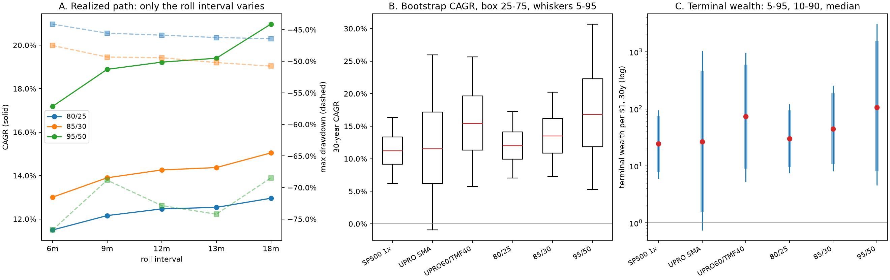

# Rolling long-dated calls: does the roll interval matter, and does the ranking survive reordering?

Generated by `letf.leaps_robustness`. Window 1986-09-29 to 2026-09-02, 10,059 sessions, on the same calendar and financing basis as `reports/hedge_alternatives_results.md`.

**The option premia here are modelled, not measured.** `letf.options` explains why
at length, and nothing below softens it: this repository holds no option price
history, so every LEAPS number is a property of an assumed implied volatility.
Resampling a modelled price thousands of times does not measure it. What the
resampling tests is whether a *ranking* computed under that assumption depends on
the order in which history arrived.

Two questions, both attempts to break the earlier result rather than improve it.

1. `letf.hedge_alternatives` buys roughly two-year calls and rolls when about a
   year is left. Nothing there ever varied that. **Part A** moves only the roll
   interval, across 6m, 9m, 12m, 13m and 18m.
2. Every number in this repository comes from one realized path. **Part B**
   resamples that path in blocks and asks whether the ranking is a property of
   the strategies or of the sequence.

## The scale a difference is read against

"Materially different" needs a unit, and the honest unit here is the one input
that cannot be checked. Shifting the assumed volatility premium by one point
moves each structure's 40-year CAGR by:

| structure | cagr_at_base | cagr_one_point_cheaper | cagr_one_point_dearer | cagr_per_volatility_point |
|---|---:|---:|---:|---:|
| LEAPS_80_25_TREASURY | 12.47% | 12.78% | 12.15% | 0.31% |
| LEAPS_85_30_TREASURY | 14.26% | 14.79% | 13.74% | 0.53% |
| LEAPS_95_50_TREASURY | 19.22% | 20.66% | 17.89% | 1.39% |

A gap between two roll intervals smaller than one of those numbers is not a
finding about roll intervals; it is inside the noise of the pricing assumption
that produced both sides of the comparison. Differences below are quoted in these
units as well as in percentage points.

## Part A — roll frequency on the realized path

Strike, premium budget, safe sleeve, two-year target maturity, the
3% volatility premium and the 100bp option
spread are all held fixed. Only the interval moves.

The interval is *nominal*. Long-dated index options are listed on a handful of
expiries — modelled here as the third Fridays of January, June and December — so a desired roll
date is mapped onto the nearest listed expiry still long enough, and the maturity
actually bought drifts. The realized figures are in the table, and they are not
the nominal ones:

| structure | roll | rolls | mean_entry_years | mean_held_years | cagr | max_drawdown | mean_delta_exposure | delta_exposure_sd | option_turnover_per_year | cost_drag_bps | cohort_20y_min_cagr | cohort_30y_min_cagr |
|---|---|---|---:|---:|---:|---:|---:|---:|---:|---:|---:|---:|
| LEAPS_80_25_TREASURY | 6m | 79 | 2.00 | 0.50 | 11.50% | -44.12% | 0.89 | 0.157 | 0.495 | 118 | 7.73% | 9.88% |
| LEAPS_80_25_TREASURY | 9m | 47 | 2.10 | 0.85 | 12.16% | -45.56% | 0.89 | 0.173 | 0.294 | 74 | 8.75% | 10.53% |
| LEAPS_80_25_TREASURY | 12m | 40 | 2.00 | 1.01 | 12.47% | -45.87% | 0.92 | 0.172 | 0.250 | 65 | 9.36% | 11.17% |
| LEAPS_80_25_TREASURY | 13m | 40 | 1.92 | 1.01 | 12.54% | -46.25% | 0.92 | 0.173 | 0.250 | 65 | 9.31% | 11.22% |
| LEAPS_80_25_TREASURY | 18m | 27 | 2.01 | 1.51 | 12.96% | -46.42% | 0.91 | 0.207 | 0.169 | 47 | 9.50% | 11.51% |
| LEAPS_85_30_TREASURY | 6m | 79 | 2.00 | 0.50 | 13.01% | -47.51% | 1.18 | 0.238 | 0.594 | 143 | 7.62% | 11.10% |
| LEAPS_85_30_TREASURY | 9m | 47 | 2.10 | 0.85 | 13.90% | -49.34% | 1.18 | 0.255 | 0.353 | 90 | 9.13% | 11.97% |
| LEAPS_85_30_TREASURY | 12m | 40 | 2.00 | 1.01 | 14.26% | -49.45% | 1.22 | 0.260 | 0.301 | 78 | 9.74% | 12.90% |
| LEAPS_85_30_TREASURY | 13m | 40 | 1.92 | 1.01 | 14.37% | -50.21% | 1.22 | 0.262 | 0.301 | 78 | 9.63% | 12.96% |
| LEAPS_85_30_TREASURY | 18m | 27 | 2.01 | 1.51 | 15.04% | -50.77% | 1.21 | 0.302 | 0.203 | 56 | 10.16% | 13.53% |
| LEAPS_95_50_TREASURY | 6m | 79 | 2.00 | 0.50 | 17.18% | -76.72% | 2.38 | 0.578 | 0.989 | 240 | 4.98% | 13.32% |
| LEAPS_95_50_TREASURY | 9m | 47 | 2.10 | 0.85 | 18.89% | -68.83% | 2.35 | 0.597 | 0.589 | 147 | 8.17% | 15.18% |
| LEAPS_95_50_TREASURY | 12m | 40 | 2.00 | 1.01 | 19.22% | -72.85% | 2.43 | 0.631 | 0.501 | 126 | 8.41% | 15.43% |
| LEAPS_95_50_TREASURY | 13m | 40 | 1.92 | 1.01 | 19.40% | -74.22% | 2.47 | 0.641 | 0.501 | 126 | 7.68% | 15.23% |
| LEAPS_95_50_TREASURY | 18m | 27 | 2.01 | 1.51 | 20.97% | -68.47% | 2.44 | 0.709 | 0.338 | 89 | 9.77% | 16.76% |

The nine-month interval is the clearest case: it cannot be bought. With three
expiries listed two years out, asking to roll every nine months produces a
realized holding period of 10.2 months. A practical schedule has about
40 rolls over four decades at the benchmark and
27 at eighteen months, whatever calendar is in the investor's head.

Twelve and thirteen months are, on this expiry calendar, very nearly the same
portfolio: the same number of rolls, and at most 0.22 volatility points of CAGR
between them across the three structures. That distinction is not one an
investor can act on.

### Stress windows

| structure | roll | 1987_crash | 2000_2002_bust | 2008_2009_gfc | 2020_covid | 2022_rates |
|---|---|---:|---:|---:|---:|---:|
| LEAPS_80_25_TREASURY | 6m | -20.0% | -26.1% | -26.2% | -10.6% | -42.8% |
| LEAPS_80_25_TREASURY | 9m | -17.2% | -21.4% | -21.2% | -14.2% | -44.0% |
| LEAPS_80_25_TREASURY | 12m | -30.1% | -20.5% | -22.5% | -10.6% | -43.6% |
| LEAPS_80_25_TREASURY | 13m | -30.1% | -23.5% | -24.8% | -9.5% | -44.3% |
| LEAPS_80_25_TREASURY | 18m | -30.1% | -19.1% | -12.0% | -10.4% | -44.8% |
| LEAPS_85_30_TREASURY | 6m | -24.7% | -39.0% | -36.4% | -16.2% | -46.5% |
| LEAPS_85_30_TREASURY | 9m | -21.2% | -33.6% | -30.5% | -20.6% | -48.3% |
| LEAPS_85_30_TREASURY | 12m | -37.1% | -32.9% | -32.1% | -16.2% | -47.4% |
| LEAPS_85_30_TREASURY | 13m | -37.1% | -36.3% | -35.1% | -14.7% | -48.7% |
| LEAPS_85_30_TREASURY | 18m | -37.1% | -30.8% | -19.7% | -15.9% | -49.4% |
| LEAPS_95_50_TREASURY | 6m | -41.3% | -73.7% | -67.0% | -37.3% | -60.4% |
| LEAPS_95_50_TREASURY | 9m | -35.0% | -68.8% | -60.8% | -43.0% | -63.3% |
| LEAPS_95_50_TREASURY | 12m | -56.2% | -69.0% | -62.6% | -37.3% | -61.5% |
| LEAPS_95_50_TREASURY | 13m | -56.2% | -72.0% | -66.8% | -34.9% | -63.4% |
| LEAPS_95_50_TREASURY | 18m | -56.2% | -66.0% | -47.6% | -36.8% | -65.1% |

Which interval came through each window best, averaged across the three
structures:

| event | best_roll | worst_roll | spread |
|---|---|---|---:|
| 1987_crash | 9m | 12m | 16.7% |
| 2000_2002_bust | 18m | 6m | 7.7% |
| 2008_2009_gfc | 18m | 6m | 16.8% |
| 2020_covid | 13m | 9m | 6.2% |
| 2022_rates | 6m | 18m | 3.2% |

No interval wins more than 2 of the five windows.
18m wins most, and it also has the highest CAGR — so the two agree here, on five observations. With five events
and a spread of up to 16.8% between the best and worst interval in a
single window, this table cannot separate a property of the roll interval from
where a crash happened to fall relative to a roll date — which is exactly the
kind of question the bootstrap below exists to answer instead.

### How far the answer moves

| structure | cagr_at_benchmark | cagr_spread | max_drawdown_at_benchmark | max_drawdown_spread | delta_exposure_sd_at_benchmark | delta_exposure_sd_spread |
|---|---:|---:|---:|---:|---:|---:|
| LEAPS_80_25_TREASURY | 12.47% | 1.46% | -45.87% | 2.30% | 0.172 | 0.050 |
| LEAPS_85_30_TREASURY | 14.26% | 2.04% | -49.45% | 3.27% | 0.260 | 0.065 |
| LEAPS_95_50_TREASURY | 19.22% | 3.79% | -72.85% | 8.25% | 0.631 | 0.131 |

Longer intervals earned more on this path, monotonically, in every structure.
Part of that is cost — the six-month roll pays 54bp a year more
than the benchmark in LEAPS_80_25_TREASURY — but cost does not explain all of it, and Part
B is better placed than this table to judge what is left.

## Part B — joint moving-block bootstrap

5,000 paths per horizon at the primary block length of 63
sessions, 2,000 paths for the 21 and 126-session sensitivity
checks, seed 20260907. Whole daily rows are resampled together — price_return, equity_total, treasury, cash, upro, tmf and dividend_yield — so
every contemporaneous relationship survives and only the order of the days is
destroyed beyond one block. Inside each path the implied-volatility proxy, the
trailing cash rate and the 200-day trend signal are **recomputed from the
resampled returns** by the same rules the historical model uses, after a
504-session warm-up that is then discarded. Nothing is re-optimized
on any path, and no path chooses its own roll interval.

Three roll intervals are simulated: the 12m benchmark and one
either side. The neighbours were fixed before any path was drawn and chosen for
what they can distinguish rather than what they earned — 13m is the same
schedule as 12m on a real expiry calendar, so the nearest distinct shorter
interval is 9m, and 18m is the only longer one Part A offers.

### What this cannot do, stated before the results

* It resamples the same forty years. It cannot produce a crash worse than 1987
  or a bond regime unlike the one observed. It is a distribution over
  *orderings*, not over futures, and no number in it is a forecast.
* **It is not neutral between the strategies.** A moving block of
  63 sessions preserves dependence within about a quarter and
  destroys it beyond. A rule with a 200-day lookback trades structure longer
  than the block, so resampling removes part of the signal it exists to exploit.
  The trend rule is handicapped here by construction, and the block-length table
  is the check on how much.
* Overlapping windows inside a path are not independent trials, so the pooled
  ten- and twenty-year probabilities carry far less precision than their
  denominators suggest.

### Thirty-year horizon

| strategy | cagr_p5 | cagr_p50 | cagr_p95 | sd_cagr | median_annualized_volatility | median_max_drawdown | prob_negative_10y | prob_negative_20y | prob_below_sp500 | prob_drawdown_worse_than_50 | prob_drawdown_worse_than_75 |
|---|---:|---:|---:|---:|---:|---:|---:|---:|---:|---:|---:|
| SP500_1X | 6.22% | 11.25% | 16.33% | 0.031 | 18.25% | -41.53% | 1.86% | 0.21% | 0.00% | 19.58% | 0.16% |
| UPRO_SMA_TO_SP500 | -0.95% | 11.56% | 25.95% | 0.082 | 41.09% | -79.15% | 19.80% | 11.16% | 47.16% | 99.90% | 65.22% |
| UPRO60_TMF40 | 5.76% | 15.40% | 25.68% | 0.061 | 32.00% | -66.22% | 6.40% | 1.67% | 13.10% | 96.80% | 21.90% |
| LEAPS_80_25_TREASURY_ROLL_9M | 6.98% | 11.78% | 17.02% | 0.031 | 16.58% | -35.68% | 1.01% | 0.05% | 38.58% | 5.70% | 0.00% |
| LEAPS_80_25_TREASURY | 7.01% | 12.01% | 17.26% | 0.031 | 16.80% | -36.32% | 1.05% | 0.05% | 33.76% | 6.18% | 0.00% |
| LEAPS_80_25_TREASURY_ROLL_18M | 7.12% | 12.22% | 17.69% | 0.032 | 17.02% | -37.17% | 1.10% | 0.05% | 29.68% | 7.60% | 0.00% |
| LEAPS_85_30_TREASURY_ROLL_9M | 7.17% | 13.20% | 19.84% | 0.039 | 20.52% | -42.06% | 1.71% | 0.12% | 13.90% | 18.00% | 0.10% |
| LEAPS_85_30_TREASURY | 7.28% | 13.48% | 20.21% | 0.040 | 20.91% | -43.04% | 1.80% | 0.14% | 11.88% | 20.42% | 0.14% |
| LEAPS_85_30_TREASURY_ROLL_18M | 7.24% | 13.68% | 20.73% | 0.041 | 21.30% | -44.44% | 2.00% | 0.14% | 9.68% | 25.54% | 0.14% |
| LEAPS_95_50_TREASURY_ROLL_9M | 5.42% | 16.59% | 29.87% | 0.075 | 38.67% | -67.38% | 7.99% | 2.18% | 9.64% | 98.20% | 24.48% |
| LEAPS_95_50_TREASURY | 5.27% | 16.82% | 30.69% | 0.078 | 39.76% | -69.27% | 8.62% | 2.51% | 10.54% | 99.06% | 29.90% |
| LEAPS_95_50_TREASURY_ROLL_18M | 4.59% | 16.93% | 31.36% | 0.081 | 40.63% | -71.53% | 9.79% | 3.13% | 12.18% | 99.52% | 37.20% |

### Terminal wealth per dollar, thirty years

| strategy | terminal_wealth_p5 | terminal_wealth_p10 | median_terminal_wealth | mean_terminal_wealth | terminal_wealth_p90 | terminal_wealth_p95 | p5_min_wealth |
|---|---:|---:|---:|---:|---:|---:|---:|
| SP500_1X | 6.1 | 8.3 | 24.5 | 33.8 | 69.8 | 93.5 | 0.638 |
| UPRO_SMA_TO_SP500 | 0.8 | 1.7 | 26.6 | 385.6 | 434.9 | 1,015.0 | 0.157 |
| UPRO60_TMF40 | 5.4 | 9.6 | 73.5 | 242.5 | 561.8 | 950.0 | 0.357 |
| LEAPS_80_25_TREASURY_ROLL_9M | 7.6 | 9.8 | 28.2 | 40.0 | 82.7 | 111.6 | 0.721 |
| LEAPS_80_25_TREASURY | 7.6 | 10.3 | 30.1 | 42.7 | 88.4 | 118.8 | 0.720 |
| LEAPS_80_25_TREASURY_ROLL_18M | 7.9 | 10.4 | 31.8 | 46.1 | 96.5 | 132.5 | 0.711 |
| LEAPS_85_30_TREASURY_ROLL_9M | 8.0 | 11.1 | 41.3 | 70.9 | 159.3 | 227.8 | 0.659 |
| LEAPS_85_30_TREASURY | 8.2 | 11.4 | 44.5 | 77.8 | 175.7 | 250.2 | 0.654 |
| LEAPS_85_30_TREASURY_ROLL_18M | 8.1 | 11.8 | 46.9 | 86.4 | 196.1 | 285.1 | 0.646 |
| LEAPS_95_50_TREASURY_ROLL_9M | 4.9 | 9.2 | 100.0 | 700.7 | 1,239.5 | 2,543.9 | 0.348 |
| LEAPS_95_50_TREASURY | 4.7 | 8.6 | 106.0 | 850.2 | 1,450.9 | 3,072.9 | 0.323 |
| LEAPS_95_50_TREASURY_ROLL_18M | 3.8 | 7.7 | 109.0 | 996.6 | 1,739.0 | 3,584.1 | 0.294 |

### Twenty-year horizon

| strategy | cagr_p5 | cagr_p50 | cagr_p95 | sd_cagr | median_annualized_volatility | median_max_drawdown | prob_negative_10y | prob_negative_20y | prob_below_sp500 | prob_drawdown_worse_than_50 | prob_drawdown_worse_than_75 |
|---|---:|---:|---:|---:|---:|---:|---:|---:|---:|---:|---:|
| SP500_1X | 5.04% | 11.34% | 17.27% | 0.038 | 18.18% | -38.77% | 1.89% | 0.18% | 0.00% | 13.14% | 0.10% |
| UPRO_SMA_TO_SP500 | -3.43% | 11.59% | 29.25% | 0.101 | 40.95% | -74.66% | 19.83% | 11.12% | 46.96% | 99.24% | 48.84% |
| UPRO60_TMF40 | 3.53% | 15.49% | 28.26% | 0.075 | 31.99% | -62.17% | 6.37% | 1.40% | 16.72% | 89.84% | 14.60% |
| LEAPS_80_25_TREASURY_ROLL_9M | 5.90% | 11.89% | 18.22% | 0.038 | 16.56% | -33.27% | 0.97% | 0.06% | 39.18% | 3.32% | 0.00% |
| LEAPS_80_25_TREASURY | 5.92% | 12.05% | 18.49% | 0.038 | 16.77% | -33.79% | 1.04% | 0.08% | 36.60% | 3.62% | 0.00% |
| LEAPS_80_25_TREASURY_ROLL_18M | 5.95% | 12.22% | 18.88% | 0.039 | 17.00% | -34.60% | 1.08% | 0.04% | 32.94% | 4.58% | 0.00% |
| LEAPS_85_30_TREASURY_ROLL_9M | 5.82% | 13.25% | 21.29% | 0.047 | 20.49% | -39.20% | 1.68% | 0.16% | 17.96% | 11.84% | 0.04% |
| LEAPS_85_30_TREASURY | 5.91% | 13.44% | 21.73% | 0.049 | 20.88% | -40.05% | 1.81% | 0.14% | 15.46% | 13.80% | 0.08% |
| LEAPS_85_30_TREASURY_ROLL_18M | 5.83% | 13.68% | 22.26% | 0.051 | 21.26% | -41.53% | 2.00% | 0.10% | 13.50% | 17.20% | 0.02% |
| LEAPS_95_50_TREASURY_ROLL_9M | 2.88% | 16.77% | 32.71% | 0.091 | 38.59% | -63.38% | 8.02% | 2.18% | 14.76% | 93.48% | 15.84% |
| LEAPS_95_50_TREASURY | 2.43% | 16.88% | 33.75% | 0.096 | 39.69% | -65.02% | 8.71% | 2.64% | 15.14% | 95.18% | 19.82% |
| LEAPS_95_50_TREASURY_ROLL_18M | 1.78% | 17.04% | 34.48% | 0.100 | 40.56% | -67.38% | 9.82% | 3.26% | 17.12% | 97.10% | 25.32% |

On this horizon the whole path *is* the twenty-year window, so
`prob_negative_20y` is the plain across-path frequency rather than a pooled
count over overlapping windows; the `negative_20y_basis` column in the CSV
records which of the two each row used.

### Where each strategy lands, against where the realized path put it

| strategy | historical_rank | mean_rank | modal_rank | prob_at_historical_rank | prob_top_two | prob_bottom_two |
|---|---|---:|---|---:|---:|---:|
| SP500_1X | 6 | 4.84 | 5 | 33.5% | 7.2% | 73.9% |
| UPRO_SMA_TO_SP500 | 2 | 4.34 | 6 | 15.8% | 21.2% | 53.8% |
| UPRO60_TMF40 | 3 | 2.39 | 2 | 23.0% | 62.0% | 7.5% |
| LEAPS_80_25_TREASURY | 5 | 4.46 | 5 | 33.7% | 8.7% | 54.4% |
| LEAPS_85_30_TREASURY | 4 | 3.15 | 3 | 33.5% | 20.1% | 2.8% |
| LEAPS_95_50_TREASURY | 1 | 1.82 | 1 | 59.6% | 80.9% | 7.5% |

UPRO_SMA_TO_SP500 loses the most ground — 2.3 places of mean rank
against where the realized path put it, and the only large deterioration in the
table. It ranked 2 of 6 on the realized path,
earning 17.15% there against a simulated median of
11.56% (not a like-for-like pair: the first spans forty years and the
second thirty, which is why rank rather than CAGR is the comparison above). Its
modal rank is 6, and it finishes below the unlevered index on
47% of paths. That agrees
with `letf.null_model`, which found the same advantage indistinguishable from a
permutation placebo and concentrated in about twenty sessions — but it is *not*
independent evidence of it, and the handicap above is real. The block-length
comparison is the place to look: the median is 9.96% at
21 sessions and 12.67% at 126, which
rises with block length, the direction the handicap predicts, and either way falls far short of the
17.15% it realized.

### The option-specific diagnostics

| strategy | mean_delta_exposure_median | mean_delta_exposure_p5 | min_exposure_after_loss_median | consecutive_poor_rolls_mean | depleted_roll_fraction_mean | underexposed_recovery_mean | paths_with_major_loss |
|---|---:|---:|---:|---:|---:|---:|---|
| LEAPS_80_25_TREASURY_ROLL_9M | 0.87 | 0.82 | 0.44 | 10.7% | 1.2% | 17.2% | 4202 |
| LEAPS_80_25_TREASURY | 0.89 | 0.84 | 0.43 | 14.3% | 1.9% | 17.6% | 4318 |
| LEAPS_80_25_TREASURY_ROLL_18M | 0.91 | 0.84 | 0.42 | 17.4% | 4.3% | 19.2% | 4405 |
| LEAPS_85_30_TREASURY_ROLL_9M | 1.15 | 1.07 | 0.43 | 15.1% | 1.6% | 19.4% | 4898 |
| LEAPS_85_30_TREASURY | 1.18 | 1.09 | 0.41 | 19.7% | 2.5% | 19.7% | 4933 |
| LEAPS_85_30_TREASURY_ROLL_18M | 1.20 | 1.10 | 0.36 | 24.4% | 5.7% | 21.5% | 4947 |
| LEAPS_95_50_TREASURY_ROLL_9M | 2.23 | 2.05 | 0.63 | 25.9% | 2.8% | 19.1% | 5000 |
| LEAPS_95_50_TREASURY | 2.30 | 2.12 | 0.56 | 34.3% | 4.4% | 18.2% | 5000 |
| LEAPS_95_50_TREASURY_ROLL_18M | 2.34 | 2.13 | 0.37 | 41.1% | 9.7% | 18.5% | 5000 |

`min_exposure_after_loss` is the median across paths of the lowest delta reached
while the portfolio was more than 30% below its own high — how far
the position deleverages exactly when it should not. `underexposed_recovery` is
the share of paths whose mean delta over the 252 sessions after
the worst trough was below 75% of that path's own average; it is
measured against the structure's own level because these three do not target the
same exposure, and a fixed 1x threshold would score the LEAPS_80_25_TREASURY structure as
permanently underexposed by design. `paths_with_major_loss` is the denominator for
both.

### Block length

| strategy | block_days | paths | cagr_p5 | cagr_p50 | sd_cagr | prob_below_sp500 |
|---|---|---|---:|---:|---:|---:|
| SP500_1X | 21 | 2000 | 5.86% | 11.37% | 0.033 | 0.0% |
| UPRO_SMA_TO_SP500 | 21 | 2000 | -2.38% | 9.96% | 0.088 | 56.8% |
| UPRO60_TMF40 | 21 | 2000 | 4.54% | 15.47% | 0.066 | 15.3% |
| LEAPS_80_25_TREASURY | 21 | 2000 | 6.42% | 11.94% | 0.033 | 37.9% |
| LEAPS_85_30_TREASURY | 21 | 2000 | 6.55% | 13.34% | 0.042 | 13.7% |
| LEAPS_95_50_TREASURY | 21 | 2000 | 3.56% | 16.06% | 0.080 | 15.4% |
| SP500_1X | 63 | 5000 | 6.22% | 11.25% | 0.031 | 0.0% |
| UPRO_SMA_TO_SP500 | 63 | 5000 | -0.95% | 11.56% | 0.082 | 47.2% |
| UPRO60_TMF40 | 63 | 5000 | 5.76% | 15.40% | 0.061 | 13.1% |
| LEAPS_80_25_TREASURY | 63 | 5000 | 7.01% | 12.01% | 0.031 | 33.8% |
| LEAPS_85_30_TREASURY | 63 | 5000 | 7.28% | 13.48% | 0.040 | 11.9% |
| LEAPS_95_50_TREASURY | 63 | 5000 | 5.27% | 16.82% | 0.078 | 10.5% |
| SP500_1X | 126 | 2000 | 5.74% | 11.28% | 0.032 | 0.0% |
| UPRO_SMA_TO_SP500 | 126 | 2000 | -0.59% | 12.67% | 0.082 | 40.2% |
| UPRO60_TMF40 | 126 | 2000 | 5.20% | 15.56% | 0.062 | 14.2% |
| LEAPS_80_25_TREASURY | 126 | 2000 | 6.71% | 12.08% | 0.032 | 33.3% |
| LEAPS_85_30_TREASURY | 126 | 2000 | 7.00% | 13.63% | 0.041 | 10.1% |
| LEAPS_95_50_TREASURY | 126 | 2000 | 4.63% | 17.35% | 0.080 | 10.8% |

This table separates the strategies by how much they depend on the resampling
choice rather than on the resampled data. Across the three block lengths the
trend rule's median CAGR moves 2.72% — the largest movement in
the table, and monotone in block length, which is the signature of a rule that trades the autocorrelation a longer block preserves. The option structures move
0.15% to 1.29%; the largest of those is
LEAPS_95_50_TREASURY, and a structure that levers every input more will
move more on any change to any of them, so that is arithmetic rather than a
second finding. Setting it aside, the remaining option rows move at most
0.29%, roughly 9 times less than the trend
rule.

## The seven questions

**1. Is 12-13 month rolling materially different from 6- or 18-month rolling?**
Twelve and thirteen months are not distinguishable from each other: at most
0.22 volatility points apart, on an expiry calendar that gives them the
same rolls. Against six months the gap is real — up to 3.08 volatility
points, always favouring the longer interval — and against eighteen months up to
1.56 points, again favouring the longer one. But those are realized-path
gaps. In the bootstrap the median CAGR moves by only 0.34% to
0.48% across the three simulated intervals — at most
1.4 volatility points — so most of the realized-path
preference for a long roll is sequence-specific rather than structural.

**2. Does a shorter roll interval reduce exposure drift enough to justify its cost?**
No, on this evidence. A shorter roll does what it is meant to: in LEAPS_85_30_TREASURY the
standard deviation of delta exposure falls from 0.260 at the
benchmark to 0.238 at six months, and the median exposure floor after a
major loss rises from 0.41 to
0.43 at nine months. It is paid for twice — 65bp a year of extra spread, and
1.25% of CAGR in total, about 2.4 volatility points.
The drift removed is real but small; the cost is real and larger. The one case
for paying it is not in the averages: it is that the exposure floor after a loss
is the thing a shorter roll protects, and an investor who cannot add capital in a
drawdown may value that more than the CAGR it costs.

**3. Which LEAPS structure is least sensitive to roll interval?**
LEAPS_80_25_TREASURY, whose CAGR spread across all five intervals is
11.7% of its own return, against
19.7% for the worst. Sensitivity to the roll interval
rises with the premium budget — the same ordering the budget imposes on every other risk in this family.

**4. Which LEAPS structure is least sensitive to simulated market sequence?**
LEAPS_80_25_TREASURY. Its CAGR dispersion across resampled orderings is
1.02 times the unlevered index's, the smallest of the three,
against 2.53 for LEAPS_95_50_TREASURY. It also holds its historical rank
on 34% of paths.

**5. Does the historical attractiveness of 85/30 survive alternative path ordering?**
Yes, and it improves in relative terms. On the realized path it ranked
4 of 6; across orderings its mean rank is
3.15, it finishes below the unlevered index on only
12% of paths, and its median CAGR of 13.48% beats the
index's 11.25% at a median drawdown deeper than the
index's (-43.0% against -41.5%). Two caveats. It gains
rank mostly because the trend rule loses it, which is a weaker compliment than it
first appears; and it is not the structure that dominates the index outright —
LEAPS_80_25_TREASURY does, at a median drawdown of -36.3% for a
median CAGR still above the index's.

**6. Does 95/50 remain attractive once sequence risk is considered?**
Its return ranking survives — modal rank 1, top-two on
81% of paths, the most stable ranking of any strategy here. Surviving does not make its
risk acceptable. A drawdown worse than 50% occurs on 99% of paths
and worse than 75% on 30%, and its fifth-percentile CAGR of
5.27% is below the unlevered index's 6.22%. It pairs
the highest median with one of the worst tails: attractive on average,
punishing in exactly the orderings that matter most to someone who cannot add
capital.

**7. Is annual rolling a genuinely robust design choice, or merely a convenient convention?**
Robust, for a better reason than convention. No structure's CAGR moves by more
than 3.1 volatility points of pricing doubt across the five intervals;
twelve and thirteen months are the same portfolio on a real expiry calendar; and
in the bootstrap the choice of structure is worth about
10 times as much as the choice of interval. The
realized path prefers eighteen months, but that preference does not survive
resampling, and in all three structures it is bought with a lower exposure
floor after losses. Annual
rolling is not optimal on the realized path. It is the interval whose answer
changes least when the path changes, which is the property worth having in a
parameter nobody can tune in advance.

## Limitations

* Option premia are modelled, not observed, and every LEAPS row inherits the
  biases listed in `letf.options`: a trailing volatility proxy that buys too
  cheaply just before a crash, and no equity skew, which makes deep in-the-money
  calls cheaper here than they are. Both flatter the option structures.
* The bootstrap resamples one realized history and preserves dependence only
  within a block. It handicaps the 200-day trend rule by construction; the
  block-length table bounds that effect without removing it.
* The dividend yield is resampled as a level rather than recomputed, so it jumps
  at block joins. Its effect on a two-year call is small beside the volatility
  assumption, but it is not zero.
* Simulated paths share one synthetic calendar taken from the front of the real
  one, so every path sees the same expiry dates and holiday structure.
* Cohort windows inside a path overlap heavily. Pooled probabilities are not
  binomial proportions and should not be given confidence intervals.
* The three structures are inputs from the earlier grid search. Nothing here
  re-searches strike, budget, roll interval, block length or volatility premium,
  which is what keeps this a falsification exercise — and also means it cannot
  discover a better structure than the ones it was handed.

