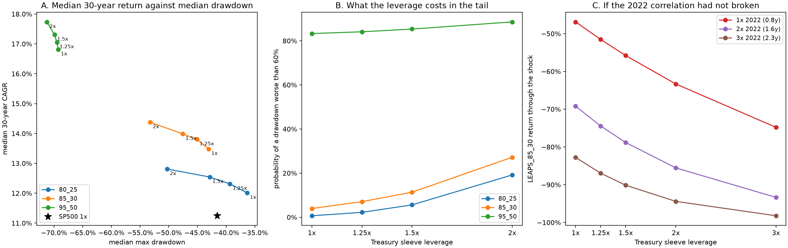

# Levering the safe sleeve: diversification, or a second bet on the same regime?

Generated by `letf.treasury_leverage`. Window 1986-09-29 to 2026-09-02, 10,059 sessions, on the same calendar, financing and option assumptions as `reports/leaps_roll_monte_carlo_results.md`.

The option family is ordered by premium budget, and budget buys return and
drawdown together. `letf.hedge_alternatives` found a second dial: duration
improved return and several drawdown statistics up to a point, and made 2022
much worse past it. This module holds the option structure fixed and levers the
*safe* sleeve instead, to ask whether return bought that way comes with better
tails than the same return bought with a bigger budget.

Only the sleeve leverage varies: 1x, 1.25x, 1.5x, 2x, with
3x and TMF carried separately as comparison rows rather than
specifications. Strike, budget, maturity, the annual roll, the volatility
premium and the option spread are all inherited unchanged.

**Option premia are modelled, not measured** — see `letf.options` — and every
favourable duration number below is drawn from a window that is one long decline
in bond yields. The weight of the argument therefore rests on the synthetic
rates shock, not on the historical columns.

## The sleeve

Constant-leverage long Treasuries, restored daily, borrowing only the exposure
above 1x at funding recovered from the repository's own 3x fund. At 1x nothing
is borrowed and nothing is assumed. The cost is measured rather than modelled:
each structure is run again on a sleeve of identical notional whose borrowing is
free, and the CAGR difference is `financing_drag_bps`.

| strategy | cagr | annualized_volatility | max_drawdown | mean_delta_exposure | treasury_notional | gross_notional | financing_drag_bps | cohort_10y_min_cagr | cohort_20y_min_cagr | cohort_20y_median_cagr | cohort_20y_sd_cagr | cohort_30y_min_cagr | cohort_30y_median_cagr |
|---|---:|---:|---:|---:|---:|---:|---:|---:|---:|---:|---:|---:|---:|
| LEAPS_80_25_TSY100 | 12.47% | 16.26% | -45.87% | 0.92 | 0.73 | 1.64 | 0 | 3.71% | 9.36% | 12.06% | 0.0094 | 11.17% | 12.96% |
| LEAPS_80_25_TSY125 | 12.73% | 17.50% | -51.21% | 0.92 | 0.91 | 1.83 | 78 | 4.58% | 10.16% | 12.87% | 0.0107 | 11.40% | 13.61% |
| LEAPS_80_25_TSY150 | 12.93% | 18.97% | -56.13% | 0.92 | 1.09 | 2.01 | 156 | 5.18% | 10.61% | 13.64% | 0.0128 | 11.57% | 14.28% |
| LEAPS_80_25_TSY200 | 13.17% | 22.39% | -64.64% | 0.92 | 1.45 | 2.37 | 316 | 3.02% | 10.50% | 14.97% | 0.0184 | 11.74% | 15.57% |
| LEAPS_85_30_TSY100 | 14.26% | 20.10% | -49.45% | 1.22 | 0.67 | 1.89 | 0 | 2.17% | 9.74% | 13.40% | 0.0115 | 12.90% | 14.66% |
| LEAPS_85_30_TSY125 | 14.52% | 20.94% | -54.35% | 1.22 | 0.84 | 2.06 | 73 | 3.03% | 10.54% | 14.04% | 0.0116 | 13.13% | 15.24% |
| LEAPS_85_30_TSY150 | 14.73% | 22.00% | -58.77% | 1.22 | 1.01 | 2.23 | 146 | 3.85% | 11.29% | 14.61% | 0.0125 | 13.31% | 15.69% |
| LEAPS_85_30_TSY200 | 14.99% | 24.63% | -66.49% | 1.23 | 1.34 | 2.57 | 296 | 4.87% | 12.29% | 16.00% | 0.0165 | 13.51% | 16.82% |
| LEAPS_95_50_TSY100 | 19.22% | 38.06% | -72.85% | 2.43 | 0.48 | 2.91 | 0 | -6.25% | 8.41% | 15.77% | 0.0285 | 15.43% | 18.73% |
| LEAPS_95_50_TSY125 | 19.46% | 38.19% | -71.56% | 2.43 | 0.60 | 3.03 | 54 | -5.43% | 9.18% | 16.39% | 0.0270 | 16.12% | 19.20% |
| LEAPS_95_50_TSY150 | 19.67% | 38.42% | -70.26% | 2.43 | 0.72 | 3.15 | 108 | -4.64% | 9.92% | 17.12% | 0.0258 | 16.79% | 19.71% |
| LEAPS_95_50_TSY200 | 19.99% | 39.19% | -74.40% | 2.44 | 0.95 | 3.39 | 219 | -3.14% | 11.28% | 18.28% | 0.0240 | 18.04% | 20.72% |

Leverage is charged for. Every 0.25x of sleeve costs roughly
73bp a year in the
LEAPS_85_30 structure, and buys about
26bp
of CAGR — the difference between the two being the excess return long Treasuries
earned over their funding across this particular forty years.

### Stress windows

| strategy | 1987_crash | 2000_2002_bust | 2008_2009_gfc | 2020_covid | 2022_rates |
|---|---:|---:|---:|---:|---:|
| LEAPS_80_25_TSY100 | -30.1% | -20.5% | -22.5% | -10.6% | -43.6% |
| LEAPS_80_25_TSY125 | -30.5% | -16.6% | -19.3% | -7.9% | -48.5% |
| LEAPS_80_25_TSY150 | -31.0% | -12.5% | -16.1% | -5.3% | -53.1% |
| LEAPS_80_25_TSY200 | -32.1% | -4.1% | -10.0% | -0.4% | -61.0% |
| LEAPS_85_30_TSY100 | -37.1% | -32.9% | -32.1% | -16.2% | -47.4% |
| LEAPS_85_30_TSY125 | -37.6% | -29.6% | -29.2% | -13.7% | -52.0% |
| LEAPS_85_30_TSY150 | -38.1% | -26.1% | -26.4% | -11.2% | -56.2% |
| LEAPS_85_30_TSY200 | -39.1% | -19.0% | -21.0% | -6.5% | -63.6% |
| LEAPS_95_50_TSY100 | -56.2% | -69.0% | -62.6% | -37.3% | -61.5% |
| LEAPS_95_50_TSY125 | -56.5% | -67.5% | -60.9% | -35.4% | -64.7% |
| LEAPS_95_50_TSY150 | -56.8% | -65.9% | -59.3% | -33.5% | -67.7% |
| LEAPS_95_50_TSY200 | -57.4% | -62.7% | -56.1% | -29.9% | -72.9% |

### The comparison rows: 3x, and what the product costs

| strategy | implementation | cagr | max_drawdown | treasury_notional | financing_drag_bps | 2022_rates |
|---|---|---:|---:|---:|---:|---:|
| LEAPS_80_25_TSY300 | constant_leverage | 12.96% | -79.19% | 2.16 | 641 | -73.1% |
| LEAPS_85_30_TSY300 | constant_leverage | 14.90% | -78.26% | 2.00 | 602 | -74.9% |
| LEAPS_95_50_TSY300 | constant_leverage | 20.25% | -82.12% | 1.42 | 447 | -80.8% |
| LEAPS_80_25_TMF | TMF | 12.25% | -79.55% | 2.16 | 712 | -73.3% |
| LEAPS_85_30_TMF | TMF | 14.23% | -78.49% | 2.00 | 669 | -75.0% |
| LEAPS_95_50_TMF | TMF | 19.75% | -82.21% | 1.42 | 497 | -80.9% |

## Do the two sleeves fall together?

A levered safe sleeve is a hedge only while it rises when equities fall. Once it
does not, the portfolio holds two leveraged bets rather than one plus a cushion —
and no statistic computed on the portfolio alone can tell those apart, because a
mild joint loss and a severe single-sleeve loss produce the same drawdown. The
sleeves have to be measured separately.

| strategy | implementation | joint_loss_3m | joint_loss_12m | worst_joint_12m | worst_joint_leg | worst_joint_sleeve | worst_joint_end |
|---|---|---:|---:|---:|---:|---:|---|
| LEAPS_80_25_TSY100 | constant_leverage | 1.40% | 1.67% | -44.9% | -71.0% | -35.9% | 2022-11-09 |
| LEAPS_80_25_TSY125 | constant_leverage | 1.86% | 2.14% | -50.4% | -71.0% | -43.2% | 2022-11-09 |
| LEAPS_80_25_TSY150 | constant_leverage | 2.15% | 2.37% | -55.3% | -71.0% | -49.8% | 2022-11-09 |
| LEAPS_80_25_TSY200 | constant_leverage | 3.10% | 2.60% | -63.7% | -71.0% | -61.1% | 2022-11-09 |
| LEAPS_85_30_TSY100 | constant_leverage | 1.43% | 1.67% | -48.3% | -76.3% | -35.9% | 2022-11-09 |
| LEAPS_85_30_TSY125 | constant_leverage | 1.91% | 2.14% | -53.4% | -76.3% | -43.2% | 2022-11-09 |
| LEAPS_85_30_TSY150 | constant_leverage | 2.23% | 2.39% | -58.0% | -76.3% | -49.8% | 2022-11-09 |
| LEAPS_85_30_TSY200 | constant_leverage | 3.28% | 2.64% | -65.8% | -76.3% | -61.1% | 2022-11-09 |
| LEAPS_95_50_TSY100 | constant_leverage | 1.50% | 1.67% | -60.9% | -85.0% | -35.9% | 2022-11-09 |
| LEAPS_95_50_TSY125 | constant_leverage | 2.05% | 2.15% | -64.5% | -85.0% | -43.2% | 2022-11-09 |
| LEAPS_95_50_TSY150 | constant_leverage | 2.46% | 2.41% | -67.7% | -85.0% | -49.8% | 2022-11-09 |
| LEAPS_95_50_TSY200 | constant_leverage | 3.71% | 2.94% | -73.3% | -85.0% | -61.1% | 2022-11-09 |
| LEAPS_80_25_TSY300 | constant_leverage | 4.75% | 2.81% | -75.8% | -71.0% | -77.3% | 2022-11-09 |
| LEAPS_85_30_TSY300 | constant_leverage | 5.03% | 2.87% | -77.1% | -76.3% | -77.3% | 2022-11-09 |
| LEAPS_95_50_TSY300 | constant_leverage | 5.80% | 3.52% | -81.2% | -85.0% | -77.3% | 2022-11-09 |
| LEAPS_80_25_TMF | TMF | 4.79% | 2.92% | -76.0% | -71.0% | -77.5% | 2022-11-09 |
| LEAPS_85_30_TMF | TMF | 5.07% | 2.99% | -77.2% | -76.3% | -77.5% | 2022-11-09 |
| LEAPS_95_50_TMF | TMF | 5.86% | 3.66% | -81.3% | -85.0% | -77.5% | 2022-11-09 |

`joint_loss_3m` is the share of rolling three-month windows in which the option
leg and the Treasury sleeve *both* lost more than
10%; `joint_loss_12m` the share of twelve-month windows
in which both lost more than 20%. The worst episode is
picked by the portfolio's own twelve-month return among the windows where both
sleeves fell, so it names the occasion that actually hurt.

Every row's worst joint episode ends on the same date. In forty years there is
one stretch where the hedge and the thing it hedges fell together, and the whole
question of whether to lever the sleeve is a question about how often that
recurs — which is exactly what a sample containing one instance cannot answer.

## Bootstrap

5,000 paths per horizon at 63-session blocks, 2,000 at
21 and 126, seed 20260907.
The Treasury funding rate is resampled as part of the same daily row as
everything else, so it stays joint with the bond returns being levered. Because
the row indices depend only on the seed and the block length, these are the same
simulated worlds `letf.leaps_robustness` reports on.

### Thirty-year horizon

| strategy | cagr_p5 | cagr_p10 | cagr_p50 | cagr_p90 | cagr_p95 | median_max_drawdown | max_drawdown_p90 | max_drawdown_p95 | prob_drawdown_worse_than_60 | prob_drawdown_worse_than_75 | prob_negative_10y | prob_below_SP500_1X | prob_below_LEAPS_85_30_TSY100 | prob_below_LEAPS_95_50_TSY100 |
|---|---:|---:|---:|---:|---:|---:|---:|---:|---:|---:|---:|---:|---:|---:|
| SP500_1X | 6.22% | 7.29% | 11.25% | 15.20% | 16.33% | -41.53% | -54.68% | -59.01% | 4.28% | 0.16% | 1.86% | 0.00% | 88.12% | 89.46% |
| LEAPS_80_25_TSY100 | 7.01% | 8.07% | 12.01% | 16.11% | 17.26% | -36.32% | -47.35% | -51.03% | 0.68% | 0.00% | 1.05% | 33.76% | 93.60% | 84.68% |
| LEAPS_85_30_TSY100 | 7.28% | 8.45% | 13.48% | 18.80% | 20.21% | -43.04% | -54.84% | -58.76% | 3.96% | 0.14% | 1.80% | 11.88% | 0.00% | 81.40% |
| LEAPS_95_50_TSY100 | 5.27% | 7.42% | 16.82% | 27.46% | 30.69% | -69.27% | -83.02% | -86.57% | 83.28% | 29.90% | 8.62% | 10.54% | 18.60% | 0.00% |
| LEAPS_80_25_TSY125 | 6.89% | 8.07% | 12.31% | 16.67% | 17.94% | -39.34% | -51.48% | -55.83% | 2.22% | 0.04% | 1.41% | 32.46% | 85.04% | 82.64% |
| LEAPS_85_30_TSY125 | 7.31% | 8.59% | 13.81% | 19.23% | 20.76% | -45.10% | -57.77% | -61.99% | 7.06% | 0.28% | 2.03% | 13.06% | 25.74% | 78.58% |
| LEAPS_95_50_TSY125 | 5.49% | 7.69% | 17.05% | 27.77% | 30.90% | -69.50% | -83.18% | -86.76% | 84.08% | 29.82% | 8.32% | 9.62% | 16.36% | 21.32% |
| LEAPS_80_25_TSY150 | 6.65% | 7.93% | 12.54% | 17.21% | 18.54% | -42.86% | -56.10% | -60.63% | 5.60% | 0.28% | 1.96% | 32.10% | 75.62% | 80.68% |
| LEAPS_85_30_TSY150 | 7.17% | 8.61% | 13.99% | 19.64% | 21.30% | -47.55% | -60.98% | -65.30% | 11.36% | 0.66% | 2.39% | 14.72% | 28.06% | 76.22% |
| LEAPS_95_50_TSY150 | 5.66% | 7.85% | 17.31% | 28.07% | 31.18% | -69.92% | -83.43% | -87.11% | 85.32% | 31.04% | 8.11% | 9.12% | 14.84% | 23.04% |
| LEAPS_80_25_TSY200 | 5.89% | 7.40% | 12.81% | 18.26% | 19.79% | -50.27% | -64.76% | -69.82% | 19.18% | 1.86% | 3.58% | 33.74% | 64.32% | 77.92% |
| LEAPS_85_30_TSY200 | 6.67% | 8.32% | 14.38% | 20.55% | 22.32% | -53.25% | -67.61% | -72.54% | 27.20% | 3.06% | 3.49% | 18.58% | 32.16% | 72.10% |
| LEAPS_95_50_TSY200 | 5.72% | 8.09% | 17.74% | 28.72% | 31.80% | -71.25% | -84.61% | -88.15% | 88.56% | 35.72% | 8.00% | 9.16% | 12.94% | 26.32% |

### Terminal wealth and exposure, thirty years

| strategy | terminal_wealth_p5 | terminal_wealth_p10 | terminal_wealth_p50 | terminal_wealth_p90 | terminal_wealth_p95 | p5_min_wealth | mean_delta_exposure_median | treasury_notional_median | gross_notional_median |
|---|---:|---:|---:|---:|---:|---:|---:|---:|---:|
| SP500_1X | 6.1 | 8.3 | 24.5 | 69.8 | 93.5 | 0.638 |  |  |  |
| LEAPS_80_25_TSY100 | 7.6 | 10.3 | 30.1 | 88.4 | 118.8 | 0.720 | 0.89 | 0.73 | 1.62 |
| LEAPS_85_30_TSY100 | 8.2 | 11.4 | 44.5 | 175.7 | 250.2 | 0.654 | 1.18 | 0.68 | 1.86 |
| LEAPS_95_50_TSY100 | 4.7 | 8.6 | 106.0 | 1,450.9 | 3,072.9 | 0.323 | 2.30 | 0.49 | 2.79 |
| LEAPS_80_25_TSY125 | 7.4 | 10.3 | 32.6 | 102.0 | 141.3 | 0.678 | 0.89 | 0.92 | 1.81 |
| LEAPS_85_30_TSY125 | 8.3 | 11.8 | 48.4 | 195.8 | 287.0 | 0.627 | 1.18 | 0.85 | 2.03 |
| LEAPS_95_50_TSY125 | 5.0 | 9.2 | 112.7 | 1,558.7 | 3,226.2 | 0.325 | 2.30 | 0.61 | 2.91 |
| LEAPS_80_25_TSY150 | 6.9 | 9.9 | 34.6 | 117.1 | 164.3 | 0.637 | 0.89 | 1.10 | 1.99 |
| LEAPS_85_30_TSY150 | 8.0 | 11.9 | 50.8 | 216.9 | 328.0 | 0.591 | 1.18 | 1.02 | 2.20 |
| LEAPS_95_50_TSY150 | 5.2 | 9.7 | 120.2 | 1,671.6 | 3,435.2 | 0.322 | 2.30 | 0.73 | 3.03 |
| LEAPS_80_25_TSY200 | 5.6 | 8.5 | 37.2 | 153.1 | 225.0 | 0.540 | 0.90 | 1.46 | 2.36 |
| LEAPS_85_30_TSY200 | 6.9 | 11.0 | 56.3 | 272.5 | 422.2 | 0.513 | 1.18 | 1.36 | 2.54 |
| LEAPS_95_50_TSY200 | 5.3 | 10.3 | 134.1 | 1,948.1 | 3,956.9 | 0.308 | 2.30 | 0.98 | 3.28 |

### Twenty-year horizon

| strategy | cagr_p5 | cagr_p10 | cagr_p50 | cagr_p90 | cagr_p95 | median_max_drawdown | max_drawdown_p90 | max_drawdown_p95 | prob_drawdown_worse_than_60 | prob_drawdown_worse_than_75 | prob_negative_10y | prob_below_SP500_1X | prob_below_LEAPS_85_30_TSY100 | prob_below_LEAPS_95_50_TSY100 |
|---|---:|---:|---:|---:|---:|---:|---:|---:|---:|---:|---:|---:|---:|---:|
| SP500_1X | 5.04% | 6.43% | 11.34% | 15.99% | 17.27% | -38.77% | -52.13% | -56.49% | 2.82% | 0.10% | 1.89% | 0.00% | 84.54% | 84.86% |
| LEAPS_80_25_TSY100 | 5.92% | 7.25% | 12.05% | 17.08% | 18.49% | -33.79% | -44.61% | -48.46% | 0.44% | 0.00% | 1.04% | 36.60% | 89.70% | 79.82% |
| LEAPS_85_30_TSY100 | 5.91% | 7.43% | 13.44% | 19.90% | 21.73% | -40.05% | -51.99% | -55.86% | 2.24% | 0.08% | 1.81% | 15.46% | 0.00% | 76.26% |
| LEAPS_95_50_TSY100 | 2.43% | 5.41% | 16.88% | 29.63% | 33.75% | -65.02% | -80.06% | -83.90% | 69.54% | 19.82% | 8.71% | 15.14% | 23.74% | 0.00% |
| LEAPS_80_25_TSY125 | 5.85% | 7.21% | 12.37% | 17.67% | 19.24% | -36.62% | -48.74% | -52.79% | 1.30% | 0.04% | 1.40% | 35.22% | 80.10% | 77.40% |
| LEAPS_85_30_TSY125 | 5.88% | 7.54% | 13.75% | 20.42% | 22.33% | -42.06% | -54.63% | -58.90% | 4.12% | 0.16% | 2.04% | 17.06% | 28.86% | 73.66% |
| LEAPS_95_50_TSY125 | 2.67% | 5.67% | 17.12% | 29.91% | 34.05% | -65.35% | -80.14% | -84.26% | 70.68% | 19.96% | 8.41% | 14.32% | 21.50% | 25.48% |
| LEAPS_80_25_TSY150 | 5.67% | 7.03% | 12.61% | 18.36% | 20.03% | -39.69% | -52.93% | -57.24% | 3.26% | 0.18% | 1.94% | 34.70% | 70.94% | 75.74% |
| LEAPS_85_30_TSY150 | 5.81% | 7.49% | 14.05% | 20.96% | 22.94% | -44.35% | -57.83% | -62.18% | 7.20% | 0.40% | 2.40% | 18.48% | 30.62% | 71.50% |
| LEAPS_95_50_TSY150 | 2.84% | 5.83% | 17.37% | 30.20% | 34.23% | -65.86% | -80.55% | -84.63% | 72.24% | 20.92% | 8.18% | 13.80% | 19.44% | 26.90% |
| LEAPS_80_25_TSY200 | 4.71% | 6.45% | 12.81% | 19.58% | 21.68% | -46.65% | -61.66% | -66.29% | 12.60% | 1.08% | 3.47% | 35.76% | 60.74% | 73.34% |
| LEAPS_85_30_TSY200 | 5.27% | 7.21% | 14.40% | 22.03% | 24.28% | -49.58% | -64.52% | -68.87% | 18.62% | 1.78% | 3.44% | 22.34% | 34.40% | 68.08% |
| LEAPS_95_50_TSY200 | 3.08% | 6.07% | 17.78% | 30.84% | 34.65% | -67.21% | -81.68% | -85.55% | 76.30% | 24.54% | 8.04% | 13.40% | 17.26% | 29.66% |

## What each route to return actually costs

Both dials buy return by accepting drawdown. The only question that matters is
which buys it more cheaply.

| step | route | cagr_gained | drawdown_given_up | drawdown_per_cagr_point | p5_cagr_change | prob_dd60_change |
|---|---|---:|---:|---:|---:|---:|
| LEAPS_80_25  1x -> 1.25x sleeve | sleeve leverage | 0.30% | 3.02% | 10.10 | -0.13% | 1.5% |
| LEAPS_80_25  1x -> 1.5x sleeve | sleeve leverage | 0.53% | 6.54% | 12.33 | -0.36% | 4.9% |
| LEAPS_80_25  1x -> 2x sleeve | sleeve leverage | 0.80% | 13.95% | 17.52 | -1.13% | 18.5% |
| LEAPS_85_30  1x -> 1.25x sleeve | sleeve leverage | 0.32% | 2.05% | 6.39 | 0.03% | 3.1% |
| LEAPS_85_30  1x -> 1.5x sleeve | sleeve leverage | 0.50% | 4.51% | 8.98 | -0.11% | 7.4% |
| LEAPS_85_30  1x -> 2x sleeve | sleeve leverage | 0.89% | 10.20% | 11.43 | -0.61% | 23.2% |
| LEAPS_95_50  1x -> 1.25x sleeve | sleeve leverage | 0.24% | 0.23% | 0.95 | 0.22% | 0.8% |
| LEAPS_95_50  1x -> 1.5x sleeve | sleeve leverage | 0.49% | 0.65% | 1.31 | 0.39% | 2.0% |
| LEAPS_95_50  1x -> 2x sleeve | sleeve leverage | 0.92% | 1.97% | 2.15 | 0.46% | 5.3% |
| LEAPS_80_25 -> LEAPS_85_30 at 1x sleeve | premium budget | 1.47% | 6.72% | 4.57 | 0.26% | 3.3% |
| LEAPS_85_30 -> LEAPS_95_50 at 1x sleeve | premium budget | 3.33% | 26.23% | 7.87 | -2.01% | 79.3% |

`drawdown_per_cagr_point` is the price: points of median drawdown paid for each
point of median CAGR bought. **Lower is cheaper**, and the two premium-budget
rows are the benchmark every sleeve-leverage row has to beat to count as a new
frontier rather than a worse way along the old one.

## The shock that does not stop

The 2022 episode replayed end to end, whole daily rows, so equity and Treasuries
fall together exactly as they did and the construction adds no correlation
assumption of its own. It simply refuses to let the episode end. One repeat
reproduces it; three asks what a rates shock running into a third year would have
done. Each row is run from 5 calendar starts, because at one
roll a year where the roll falls relative to the shock is luck rather than
leverage — `roll_luck_spread` reports how much of the answer that luck is.

| strategy | repeats | stressed_years | mean_return | worst_return | roll_luck_spread | mean_max_drawdown |
|---|---|---:|---:|---:|---:|---:|
| LEAPS_85_30_TSY100 | 1 | 0.78 | -46.9% | -47.3% | 0.88% | -47.0% |
| LEAPS_85_30_TSY125 | 1 | 0.78 | -51.5% | -52.0% | 0.88% | -51.7% |
| LEAPS_85_30_TSY150 | 1 | 0.78 | -55.8% | -56.3% | 0.88% | -56.0% |
| LEAPS_85_30_TSY200 | 1 | 0.78 | -63.3% | -63.8% | 0.88% | -63.5% |
| LEAPS_85_30_TSY300 | 1 | 0.78 | -74.8% | -75.3% | 0.88% | -75.0% |
| LEAPS_85_30_TSY100 | 2 | 1.56 | -69.2% | -70.4% | 3.16% | -69.2% |
| LEAPS_85_30_TSY125 | 2 | 1.56 | -74.4% | -75.3% | 2.43% | -74.5% |
| LEAPS_85_30_TSY150 | 2 | 1.56 | -78.8% | -79.5% | 1.83% | -78.9% |
| LEAPS_85_30_TSY200 | 2 | 1.56 | -85.5% | -85.9% | 0.97% | -85.6% |
| LEAPS_85_30_TSY300 | 2 | 1.56 | -93.4% | -93.5% | 0.20% | -93.4% |
| LEAPS_85_30_TSY100 | 3 | 2.33 | -82.8% | -83.5% | 1.30% | -82.8% |
| LEAPS_85_30_TSY125 | 3 | 2.33 | -87.0% | -87.5% | 0.97% | -87.0% |
| LEAPS_85_30_TSY150 | 3 | 2.33 | -90.1% | -90.5% | 0.72% | -90.2% |
| LEAPS_85_30_TSY200 | 3 | 2.33 | -94.4% | -94.6% | 0.38% | -94.4% |
| LEAPS_85_30_TSY300 | 3 | 2.33 | -98.2% | -98.3% | 0.18% | -98.2% |

One repeat is the control, and it very nearly reproduces the episode: LEAPS_85_30
at 1x returns -46.9%
through it against -47.4% realized. The
small gap is the option position rather than the data — the synthetic path opens a
fresh contract as the shock begins, while the realized path carried one already in
flight — and it is the size of the discrepancy a reader should keep in mind for
the two- and three-repeat rows, which have no control.

## The frontier

| strategy | median_30y_cagr | p5_30y_cagr | median_max_drawdown | prob_drawdown_worse_than_60 | rates_shock_2022 | synthetic_shock | prob_below_sp500 |
|---|---:|---:|---:|---:|---:|---:|---:|
| SP500_1X | 11.25% | 6.22% | -41.5% | 4.3% | -24.0% | -56.1% | 0.0% |
| LEAPS_80_25_TSY100 | 12.01% | 7.01% | -36.3% | 0.7% | -43.6% | -80.0% | 33.8% |
| LEAPS_85_30_TSY100 | 13.48% | 7.28% | -43.0% | 4.0% | -47.4% | -82.8% | 11.9% |
| LEAPS_95_50_TSY100 | 16.82% | 5.27% | -69.3% | 83.3% | -61.5% | -91.3% | 10.5% |
| LEAPS_80_25_TSY125 | 12.31% | 6.89% | -39.3% | 2.2% | -48.5% | -84.9% | 32.5% |
| LEAPS_85_30_TSY125 | 13.81% | 7.31% | -45.1% | 7.1% | -52.0% | -87.0% | 13.1% |
| LEAPS_95_50_TSY125 | 17.05% | 5.49% | -69.5% | 84.1% | -64.7% | -93.3% | 9.6% |
| LEAPS_80_25_TSY150 | 12.54% | 6.65% | -42.9% | 5.6% | -53.1% | -88.6% | 32.1% |
| LEAPS_85_30_TSY150 | 13.99% | 7.17% | -47.6% | 11.4% | -56.2% | -90.1% | 14.7% |
| LEAPS_95_50_TSY150 | 17.31% | 5.66% | -69.9% | 85.3% | -67.7% | -94.9% | 9.1% |
| LEAPS_80_25_TSY200 | 12.81% | 5.89% | -50.3% | 19.2% | -61.0% | -93.5% | 33.7% |
| LEAPS_85_30_TSY200 | 14.38% | 6.67% | -53.2% | 27.2% | -63.6% | -94.4% | 18.6% |
| LEAPS_95_50_TSY200 | 17.74% | 5.72% | -71.2% | 88.6% | -72.9% | -97.0% | 9.2% |

## The eight questions

**1. Does 1.25x Treasury leverage improve the frontier?**
Yes, on both counts. In LEAPS_85_30 it lifts the median
30-year CAGR by 0.32% to 13.81%, pays
2.05% more median drawdown for it, and moves the fifth
percentile by +0.03%. That is a price of 6.39 points of
drawdown per point of CAGR, against 7.87 for the budget step a holder of
LEAPS_85_30 could actually take instead — moving to LEAPS_95_50 — so the return
is bought more cheaply this way. The probability of a
drawdown worse than 60% is 7.1%, against
4.0% unlevered. Through a rates shock lasting
3 times as long as 2022 it returns -87.0%, against
-82.8% unlevered.

**2. Does 1.5x Treasury leverage improve the frontier?**
No. In LEAPS_85_30 it lifts the median
30-year CAGR by 0.50% to 13.99%, pays
4.51% more median drawdown for it, and moves the fifth
percentile by -0.11%. That is a price of 8.98 points of
drawdown per point of CAGR, against 7.87 for the budget step a holder of
LEAPS_85_30 could actually take instead — moving to LEAPS_95_50 — so the return
is bought less cheaply this way. The probability of a
drawdown worse than 60% is 11.4%, against
4.0% unlevered. Through a rates shock lasting
3 times as long as 2022 it returns -90.1%, against
-82.8% unlevered.

**3. Does 2x Treasury leverage improve the frontier?**
No. In LEAPS_85_30 it lifts the median
30-year CAGR by 0.89% to 14.38%, pays
10.20% more median drawdown for it, and moves the fifth
percentile by -0.61%. That is a price of 11.43 points of
drawdown per point of CAGR, against 7.87 for the budget step a holder of
LEAPS_85_30 could actually take instead — moving to LEAPS_95_50 — so the return
is bought less cheaply this way. The probability of a
drawdown worse than 60% is 27.2%, against
4.0% unlevered. Through a rates shock lasting
3 times as long as 2022 it returns -94.4%, against
-82.8% unlevered.

**4. At what point does the Treasury sleeve stop behaving like a hedge?**
Two readings, and they agree. On how often the
sleeves fall together, the crossing is at 2x: that is where three-month
windows in which the option leg and the sleeve *both* lose more than
10% become twice as common as they are unlevered
(1.43% of windows in LEAPS_85_30 at 1x). On which exposure
dominates the portfolio, it is 2x, where Treasury notional first
exceeds the option sleeve's delta. Neither is a regime break — the change is
continuous and every step of leverage buys a little more of it — but the two
readings arriving at the same place is
worth noting, because the point where the sleeve becomes the larger risk is far easier to see in advance than the point where it stops diversifying.

**5. Can LEAPS_85_30 with modest Treasury leverage approach LEAPS_95_50's return with better tails?**
No. At the top of the modest range LEAPS_85_30_TSY200 reaches a median 30-year CAGR of
14.38% against LEAPS_95_50_TSY100's
16.82% — 2.44% short — and still trails it
outright on 72% of paths. Its
tails are better (27.2% chance
of a drawdown worse than 60% against
83.3%), but that is a
comparison the *unlevered* LEAPS_85_30 wins by more, at
4.0%. Treasury leverage does not close the
return gap. It spends part of the tail advantage that was the reason to prefer
LEAPS_85_30 in the first place, and buys about
27%
of the distance in return for doing so.

**6. Does the result survive Monte Carlo reordering?**
Yes, on direction. On the realized path LEAPS_85_30 gains
0.73% of CAGR going
from 1x to 2x and its worst drawdown deepens by
17.04%;
across resampled orderings the median gain is
0.89% and the median worst drawdown deepens by
10.20%. Those two drawdown figures are
not the same statistic — one is a single realization over forty years, the other
a median over thirty-year paths — so the number worth taking from the bootstrap
is the one the realized path cannot supply. That is the fifth percentile of CAGR,
which turns against leverage from
1.5x onwards, and the
probability of a drawdown worse than 60%, which rises from
4.0% to 27.2%.
Leverage is paid for in the tail rather than in the middle, and only the
resampling shows that clearly.

**7. Does the conclusion hold under prolonged positive stock/bond correlation?**
It strengthens, and this is the part of the report carrying the most weight.
Replaying 2022 until it has run 3 times its length,
LEAPS_85_30 at 1x returns -82.8% and
at 2x returns -94.4% — the
unlevered sleeve leaves 3.1 times as much capital standing. Roll
timing explains almost none of it: across 5 calendar starts
the spread of outcomes is at most
1.51%. The historical record cannot price this
scenario, because it contains exactly one instance of the correlation that drives
it, and the block bootstrap cannot generate it either, because a joint-loss
regime outlasting one 63-session block cannot survive the
resampling. Every favourable number above is drawn from the world in which that
correlation broke within a year.

**8. Is leveraged Treasury exposure better implemented as constant leverage than as TMF?**
Yes on cost, and the two are not the same instrument. At matched
3x notional the fund costs
67bp
a year more than financing alone — its expense ratio and spread on top of the
borrowing — worth
0.67% of
CAGR in LEAPS_85_30 across this window. The conceptual difference matters more
than the fee: a constant-leverage sleeve is defined by the exposure it holds,
while a daily-reset fund is defined by a rule that produces that exposure and
carries a path dependence besides. They are separate rows here so that neither is
silently substituted for the other, which is also why 3x appears
only as a comparison and never as a specification.

## What this does and does not settle

Modest Treasury leverage is mostly not a second source of return in this
architecture. It is the same duration bet, taken larger — and the historical
record cannot tell those two apart, because the one episode that would
distinguish them happened once and lasted ten months.

Priced against the budget step each structure could actually take instead,
sleeve leverage is the cheaper route in
LEAPS_85_30. Measured on the
fifth percentile rather than the median it is genuinely helpful in
LEAPS_95_50 — LEAPS_95_50 carries the smallest sleeve of the three, 0.49 of notional against 0.73 for the largest, so levering it adds a risk genuinely different from the one already dominating that portfolio. Everywhere else it
buys the middle of the distribution by selling the bottom of it.

It is nowhere a free improvement. Every step of leverage makes the prolonged-shock column worse, monotonically, in every structure, and that column is the only
one in this report drawn from a regime the sample does not contain.

The defensible reading is narrow: a small amount of sleeve leverage is an
efficient way to move along the existing frontier for a structure whose drawdown
is already dominated by equity, and it is not a way to reach a better frontier.
An investor unwilling to hold LEAPS_95_50_TSY100 for its tail should not expect
LEAPS_85_30_TSY200 to be a substitute for it.

## Limitations

* Option premia are modelled, not observed, and inherit every bias listed in
  `letf.options`. The option leg enters the joint-loss diagnostic as a modelled
  series, so that diagnostic is only as good as the pricing assumption.
* The window is one long decline in bond yields. Every historical column
  favourable to duration inherits that, the cohort minima included — and those
  improve with leverage precisely because the windows containing the one
  joint-loss episode end almost as soon as it begins.
* The synthetic shock repeats one realized episode. It bounds how bad a
  prolonged positive correlation would have been *given the 2022 dynamics*; it
  is not a distribution over rate shocks and says nothing about one of a
  different shape.
* Financing is recovered from the 3x fund's own identity, so it carries that
  product's funding spread. An investor borrowing at a different rate would find
  every leverage step cheaper or dearer by the difference, and the exchange-rate
  table is the first thing that would move.
* The bootstrap resamples the same forty years and preserves dependence only
  within a block, so it cannot produce the regime the synthetic shock exists to
  test. The two are reported separately for that reason and should not be read
  as two views of the same thing.
