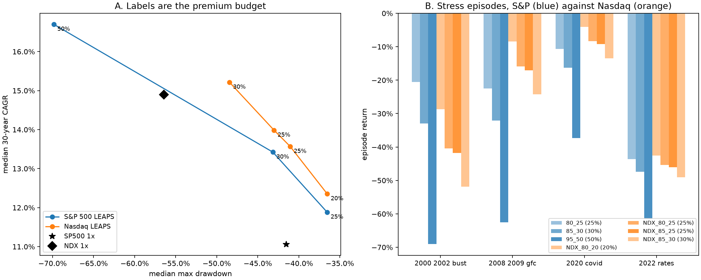

# Nasdaq LEAPS: does a faster underlying need less option capital?

Generated by `letf.nasdaq_leaps`. Window 1986-09-29 to 2026-09-02, 10,059 sessions, on the same calendar, financing and option assumptions as `reports/hedge_alternatives_results.md`.

Every option structure studied here so far is written on the S&P 500, and the
family is ordered by premium budget: more budget, more return, more drawdown. The
Nasdaq-100 grew faster over this window and was materially more volatile. Those
push opposite ways on one question — **can a higher-growth underlying reach
comparable long-run returns with less capital at risk in options, or does the
volatility take back through the option price what the growth rate gives?**

Four Nasdaq structures, prespecified and not searched. Everything else is
inherited: roughly two-year maturity, annual roll on listed expiries, a trailing
realized-volatility proxy over the option's own horizon plus
3% of volatility premium, the same Black-Scholes framework, the
same 100bp spread, residual capital in long Treasuries.

**Two caveats belong before the numbers, not after them.**

The volatility premium is *not* retuned for the Nasdaq. Real Nasdaq index options
are not priced off the S&P's skew, and this repository observes neither. Reusing
the S&P assumption keeps the comparison between structures clean, but a flat
premium is proportionally a smaller loading on a more volatile underlying —
realized volatility averages
24.1% for the Nasdaq against
17.2% for the S&P — so
the Nasdaq rows are being charged relatively less for their options. The
break-even table below is the answer to that, and it is the number to read rather
than any CAGR here.

Nasdaq total returns are a price-only proxy through 1999-03-04, grossed up
with an assumed zero dividend yield. The 1987 column lies entirely inside that
era and is labelled. The dot-com bust does not, and it is the episode this
comparison turns on.

## Historical

| strategy | family | premium_budget | cagr | annualized_volatility | max_drawdown | mean_delta_exposure | mean_option_weight | cohort_10y_min_cagr | cohort_20y_min_cagr | cohort_20y_min_cagr_post_proxy | cohort_20y_median_cagr | cohort_30y_min_cagr | cohort_30y_median_cagr |
|---|---|---:|---:|---:|---:|---:|---:|---:|---:|---:|---:|---:|---:|
| SP500_1X | comparator |  | 11.26% | 18.35% | -55.25% | 1.00 |  | -3.20% | 4.79% | 4.79% | 8.78% | 9.34% | 10.31% |
| NASDAQ100_1X | comparator |  | 14.93% | 26.06% | -82.87% | 1.00 |  | -7.72% | 3.69% | 3.69% | 11.82% | 12.28% | 13.88% |
| UPRO_SMA_TO_SP500 | comparator |  | 17.15% | 37.70% | -75.41% | 2.51 |  | -10.10% | 6.81% | 6.90% | 13.58% | 13.10% | 16.25% |
| TQQQ_SMA_TO_NASDAQ | comparator |  | 20.46% | 58.09% | -96.46% | 2.51 |  | -18.29% | -0.28% | -0.28% | 15.32% | 12.56% | 20.98% |
| UPRO60_TMF40 | comparator |  | 17.03% | 31.95% | -70.69% | 1.80 |  | -5.98% | 10.87% | 12.84% | 16.34% | 15.01% | 18.16% |
| LEAPS_80_25_TREASURY | SP500 LEAPS | 25.00% | 12.47% | 16.26% | -45.87% | 0.92 | 27.38% | 3.71% | 9.36% | 10.23% | 12.06% | 11.17% | 12.96% |
| LEAPS_85_30_TREASURY | SP500 LEAPS | 30.00% | 14.26% | 20.10% | -49.45% | 1.22 | 32.66% | 2.17% | 9.74% | 10.81% | 13.40% | 12.90% | 14.66% |
| LEAPS_95_50_TREASURY | SP500 LEAPS | 50.00% | 19.22% | 38.06% | -72.85% | 2.43 | 52.26% | -6.25% | 8.41% | 9.87% | 15.77% | 15.43% | 18.73% |
| NDX_LEAPS_80_20_TREASURY | NDX LEAPS | 20.00% | 13.64% | 16.32% | -47.37% | 0.64 | 22.88% | 3.54% | 11.09% | 11.09% | 13.79% | 13.11% | 14.66% |
| NDX_LEAPS_80_25_TREASURY | NDX LEAPS | 25.00% | 15.27% | 18.87% | -50.02% | 0.79 | 28.15% | 2.38% | 11.48% | 11.48% | 15.02% | 14.80% | 16.26% |
| NDX_LEAPS_85_25_TREASURY | NDX LEAPS | 25.00% | 15.94% | 20.09% | -50.89% | 0.85 | 28.31% | 2.02% | 11.82% | 11.82% | 15.57% | 15.41% | 16.95% |
| NDX_LEAPS_85_30_TREASURY | NDX LEAPS | 30.00% | 17.53% | 23.14% | -55.00% | 1.01 | 33.45% | 0.64% | 12.11% | 12.11% | 16.76% | 16.46% | 18.40% |

### Stress episodes

| strategy | premium_budget | 1987_crash | 2000_2002_bust | 2008_2009_gfc | 2020_covid | 2022_rates |
|---|---:|---:|---:|---:|---:|---:|
| SP500_1X |  | -32.8% | -47.4% | -54.9% | -33.5% | -24.0% |
| NASDAQ100_1X |  | -37.7% | -82.7% | -51.3% | -27.1% | -33.5% |
| UPRO_SMA_TO_SP500 |  | -54.7% | -67.3% | -65.0% | -48.0% | -46.2% |
| TQQQ_SMA_TO_NASDAQ |  | -70.9% | -96.3% | -68.7% | -59.1% | -55.3% |
| UPRO60_TMF40 |  | -48.6% | -61.5% | -70.3% | -29.2% | -66.2% |
| LEAPS_80_25_TREASURY | 25% | -30.1% | -20.5% | -22.5% | -10.6% | -43.6% |
| LEAPS_85_30_TREASURY | 30% | -37.1% | -32.9% | -32.1% | -16.2% | -47.4% |
| LEAPS_95_50_TREASURY | 50% | -56.2% | -69.0% | -62.6% | -37.3% | -61.5% |
| NDX_LEAPS_80_20_TREASURY | 20% | -26.1% | -28.7% | -8.5% | -4.0% | -42.6% |
| NDX_LEAPS_80_25_TREASURY | 25% | -31.1% | -40.4% | -15.9% | -8.3% | -45.4% |
| NDX_LEAPS_85_25_TREASURY | 25% | -33.4% | -41.8% | -17.1% | -9.2% | -46.1% |
| NDX_LEAPS_85_30_TREASURY | 30% | -38.1% | -51.9% | -24.3% | -13.5% | -49.0% |

The 1987 column is inside the Nasdaq proxy era for every row and should not carry
weight on its own. The dot-com bust should: it is the episode in which the
Nasdaq's excess growth was repaid, it is outside the proxy era, and it is the
sharpest available test of whether a Nasdaq-based structure is a better bargain
or merely a more concentrated one.

## How much rests on the volatility assumption

| structure | premium_budget | cagr_at_base_premium | proportionally_matched_premium | cagr_at_matched_premium | LEAPS_80_25_TREASURY_breakeven_premium | LEAPS_85_30_TREASURY_breakeven_premium | LEAPS_95_50_TREASURY_breakeven_premium |
|---|---:|---:|---:|---:|---:|---:|---:|
| NDX_LEAPS_80_20_TREASURY | 20% | 13.64% | 4.20% | 13.31% | 7.41% | 0.79% |  |
| NDX_LEAPS_80_25_TREASURY | 25% | 15.27% | 4.20% | 14.87% | 12.12% | 6.07% |  |
| NDX_LEAPS_85_25_TREASURY | 25% | 15.94% | 4.20% | 15.42% | 12.25% | 7.08% | -3.79% |
| NDX_LEAPS_85_30_TREASURY | 30% | 17.53% | 4.20% | 16.93% | 15.14% | 10.17% | -0.12% |

Each break-even column is the volatility premium at which that Nasdaq structure
stops beating that S&P structure. A blank means it never does within the bracket
searched. `proportionally_matched_premium` scales the flat three points by the
ratio of the two indices' realized volatilities, so the Nasdaq options are
charged the same loading *relative to their own volatility* that the S&P options
carry; the column beside it is what that costs.

## Bootstrap

2,000 paths per horizon at 63-session blocks, seed 20260907, one
shared set of resampled worlds across every strategy. Whole daily rows are drawn,
so the Nasdaq's excess growth and its excess volatility arrive together, which is
the entire question. Nothing is re-optimized on any path.

### Thirty years

| strategy | premium_budget | cagr_p5 | cagr_p10 | cagr_p50 | cagr_p90 | cagr_p95 | terminal_wealth_p5 | terminal_wealth_p50 | terminal_wealth_p95 | median_max_drawdown | prob_drawdown_worse_than_50 | prob_drawdown_worse_than_60 | prob_drawdown_worse_than_75 | prob_negative_cagr | prob_below_own_underlying | prob_below_sp500 |
|---|---:|---:|---:|---:|---:|---:|---:|---:|---:|---:|---:|---:|---:|---:|---:|---:|
| SP500_1X |  | 6.24% | 7.19% | 11.06% | 15.17% | 16.36% | 6.1 | 23.2 | 94.3 | -41.55% | 20.80% | 4.40% | 0.10% | 0.00% | 0.00% | 0.00% |
| NASDAQ100_1X |  | 6.66% | 8.40% | 14.89% | 21.72% | 23.72% | 6.9 | 64.4 | 593.7 | -56.44% | 73.35% | 37.50% | 6.20% | 0.00% | 0.00% | 11.40% |
| LEAPS_80_25_TREASURY | 25.00% | 6.94% | 7.89% | 11.88% | 15.97% | 17.11% | 7.5 | 29.1 | 114.3 | -36.56% | 6.90% | 0.85% | 0.00% | 0.00% | 35.05% | 35.05% |
| LEAPS_85_30_TREASURY | 30.00% | 7.16% | 8.37% | 13.42% | 18.71% | 20.02% | 8.0 | 43.8 | 238.3 | -43.17% | 21.80% | 4.35% | 0.20% | 0.00% | 12.50% | 12.50% |
| LEAPS_95_50_TREASURY | 50.00% | 5.14% | 7.29% | 16.70% | 27.22% | 30.26% | 4.5 | 102.9 | 2,784.8 | -69.85% | 99.00% | 83.30% | 31.65% | 0.60% | 10.80% | 10.80% |
| NDX_LEAPS_80_20_TREASURY | 20.00% | 6.75% | 7.98% | 12.35% | 16.88% | 17.96% | 7.1 | 32.9 | 142.1 | -36.55% | 7.40% | 1.10% | 0.00% | 0.00% | 79.75% | 33.05% |
| NDX_LEAPS_80_25_TREASURY | 25.00% | 7.27% | 8.56% | 13.57% | 19.05% | 20.46% | 8.2 | 45.5 | 266.1 | -41.05% | 17.45% | 2.90% | 0.10% | 0.00% | 69.25% | 19.05% |
| NDX_LEAPS_85_25_TREASURY | 25.00% | 7.22% | 8.63% | 13.99% | 19.86% | 21.52% | 8.1 | 50.8 | 346.8 | -43.02% | 22.95% | 4.60% | 0.20% | 0.00% | 63.70% | 16.90% |
| NDX_LEAPS_85_30_TREASURY | 30.00% | 7.40% | 8.94% | 15.22% | 22.03% | 24.02% | 8.5 | 70.1 | 638.1 | -48.45% | 44.40% | 12.80% | 0.75% | 0.00% | 40.70% | 10.85% |

### Twenty years

| strategy | premium_budget | cagr_p5 | cagr_p10 | cagr_p50 | cagr_p90 | cagr_p95 | terminal_wealth_p5 | terminal_wealth_p50 | terminal_wealth_p95 | median_max_drawdown | prob_drawdown_worse_than_50 | prob_drawdown_worse_than_60 | prob_drawdown_worse_than_75 | prob_negative_cagr | prob_below_own_underlying | prob_below_sp500 |
|---|---:|---:|---:|---:|---:|---:|---:|---:|---:|---:|---:|---:|---:|---:|---:|---:|
| SP500_1X |  | 4.91% | 6.32% | 11.14% | 15.92% | 17.03% | 2.6 | 8.3 | 23.2 | -38.88% | 13.90% | 2.80% | 0.10% | 0.25% | 0.00% | 0.00% |
| NASDAQ100_1X |  | 4.63% | 6.82% | 15.01% | 22.91% | 24.96% | 2.5 | 16.4 | 86.2 | -52.55% | 58.70% | 26.70% | 3.95% | 0.50% | 0.00% | 15.50% |
| LEAPS_80_25_TREASURY | 25.00% | 5.91% | 7.18% | 11.89% | 16.91% | 18.24% | 3.2 | 9.5 | 28.6 | -34.02% | 3.85% | 0.50% | 0.00% | 0.00% | 36.85% | 36.85% |
| LEAPS_85_30_TREASURY | 30.00% | 5.93% | 7.37% | 13.29% | 19.73% | 21.41% | 3.2 | 12.1 | 48.4 | -40.39% | 14.40% | 2.35% | 0.10% | 0.10% | 16.15% | 16.15% |
| LEAPS_95_50_TREASURY | 50.00% | 2.56% | 5.28% | 16.51% | 29.50% | 32.97% | 1.7 | 21.2 | 298.8 | -65.61% | 95.60% | 70.45% | 20.90% | 2.90% | 16.20% | 16.20% |
| NDX_LEAPS_80_20_TREASURY | 20.00% | 5.56% | 7.15% | 12.36% | 17.71% | 19.39% | 3.0 | 10.3 | 34.6 | -33.25% | 4.50% | 0.70% | 0.00% | 0.00% | 74.80% | 35.20% |
| NDX_LEAPS_80_25_TREASURY | 25.00% | 5.79% | 7.46% | 13.76% | 19.96% | 21.82% | 3.1 | 13.2 | 51.8 | -37.73% | 11.40% | 1.90% | 0.10% | 0.10% | 65.45% | 22.05% |
| NDX_LEAPS_85_25_TREASURY | 25.00% | 5.59% | 7.46% | 14.21% | 20.89% | 22.88% | 3.0 | 14.3 | 61.6 | -39.56% | 15.00% | 2.75% | 0.15% | 0.10% | 61.30% | 20.10% |
| NDX_LEAPS_85_30_TREASURY | 30.00% | 5.38% | 7.51% | 15.39% | 23.21% | 25.68% | 2.9 | 17.5 | 96.6 | -44.72% | 30.50% | 8.05% | 0.50% | 0.20% | 41.15% | 13.95% |

### Ten years

| strategy | premium_budget | cagr_p5 | cagr_p10 | cagr_p50 | cagr_p90 | cagr_p95 | terminal_wealth_p5 | terminal_wealth_p50 | terminal_wealth_p95 | median_max_drawdown | prob_drawdown_worse_than_50 | prob_drawdown_worse_than_60 | prob_drawdown_worse_than_75 | prob_negative_cagr | prob_below_own_underlying | prob_below_sp500 |
|---|---:|---:|---:|---:|---:|---:|---:|---:|---:|---:|---:|---:|---:|---:|---:|---:|
| SP500_1X |  | 2.06% | 3.94% | 11.49% | 18.12% | 19.87% | 1.2 | 3.0 | 6.1 | -33.79% | 7.15% | 1.20% | 0.05% | 1.90% | 0.00% | 0.00% |
| NASDAQ100_1X |  | 1.17% | 3.92% | 15.18% | 26.73% | 29.63% | 1.1 | 4.1 | 13.4 | -46.02% | 35.30% | 13.45% | 1.80% | 4.20% | 0.00% | 21.50% |
| LEAPS_80_25_TREASURY | 25.00% | 3.02% | 4.94% | 12.03% | 19.16% | 21.20% | 1.3 | 3.1 | 6.8 | -29.51% | 1.70% | 0.20% | 0.00% | 1.05% | 43.05% | 43.05% |
| LEAPS_85_30_TREASURY | 30.00% | 2.25% | 4.67% | 13.52% | 22.68% | 25.33% | 1.2 | 3.6 | 9.6 | -35.39% | 7.65% | 1.05% | 0.05% | 1.70% | 25.70% | 25.70% |
| LEAPS_95_50_TREASURY | 50.00% | -3.38% | 0.76% | 16.70% | 35.60% | 41.36% | 0.7 | 4.7 | 31.8 | -58.14% | 78.45% | 43.95% | 9.10% | 9.05% | 24.45% | 24.45% |
| NDX_LEAPS_80_20_TREASURY | 20.00% | 3.03% | 4.83% | 12.63% | 20.60% | 22.51% | 1.3 | 3.3 | 7.6 | -28.34% | 2.00% | 0.25% | 0.00% | 1.50% | 69.55% | 39.50% |
| NDX_LEAPS_80_25_TREASURY | 25.00% | 2.85% | 4.93% | 13.88% | 23.43% | 25.79% | 1.3 | 3.7 | 9.9 | -32.45% | 4.85% | 0.85% | 0.00% | 1.95% | 63.05% | 30.40% |
| NDX_LEAPS_85_25_TREASURY | 25.00% | 2.65% | 4.83% | 14.25% | 24.68% | 27.48% | 1.3 | 3.8 | 11.3 | -33.91% | 6.85% | 1.20% | 0.10% | 2.25% | 58.85% | 27.95% |
| NDX_LEAPS_85_30_TREASURY | 30.00% | 2.06% | 4.59% | 15.43% | 27.77% | 30.96% | 1.2 | 4.2 | 14.8 | -38.68% | 15.20% | 3.45% | 0.20% | 2.75% | 44.70% | 23.45% |

## The key comparison

| strategy | premium_budget | median_20y_cagr | p5_20y_cagr | median_30y_cagr | p5_30y_cagr | median_max_drawdown | prob_drawdown_worse_than_60 | mean_delta_exposure |
|---|---:|---:|---:|---:|---:|---:|---:|---:|
| SP500_1X |  | 11.14% | 4.91% | 11.06% | 6.24% | -41.6% | 4.4% |  |
| NASDAQ100_1X |  | 15.01% | 4.63% | 14.89% | 6.66% | -56.4% | 37.5% |  |
| LEAPS_80_25_TREASURY | 25% | 11.89% | 5.91% | 11.88% | 6.94% | -36.6% | 0.9% | 0.89 |
| LEAPS_85_30_TREASURY | 30% | 13.29% | 5.93% | 13.42% | 7.16% | -43.2% | 4.3% | 1.18 |
| LEAPS_95_50_TREASURY | 50% | 16.51% | 2.56% | 16.70% | 5.14% | -69.9% | 83.3% | 2.30 |
| NDX_LEAPS_80_20_TREASURY | 20% | 12.36% | 5.56% | 12.35% | 6.75% | -36.5% | 1.1% | 0.60 |
| NDX_LEAPS_80_25_TREASURY | 25% | 13.76% | 5.79% | 13.57% | 7.27% | -41.1% | 2.9% | 0.74 |
| NDX_LEAPS_85_25_TREASURY | 25% | 14.21% | 5.59% | 13.99% | 7.22% | -43.0% | 4.6% | 0.79 |
| NDX_LEAPS_85_30_TREASURY | 30% | 15.39% | 5.38% | 15.22% | 7.40% | -48.5% | 12.8% | 0.94 |

## Questions eight to fourteen

**8. Does the Nasdaq's higher growth allow materially lower premium budgets?**
Yes, on this data. NDX_LEAPS_80_20_TREASURY at 20% matches LEAPS_80_25_TREASURY at 25%, NDX_LEAPS_80_25_TREASURY at 25% matches LEAPS_85_30_TREASURY at 30%, NDX_LEAPS_85_25_TREASURY at 25% matches LEAPS_85_30_TREASURY at 30%.
The mechanism is visible in the exposure column: NDX_LEAPS_85_30_TREASURY carries a mean delta of
0.94 against LEAPS_95_50_TREASURY's
2.30, so it reaches a comparable return
holding less than half the equity sensitivity, because the equity it holds
compounded faster.

**9. Which Nasdaq structure has the best downside-adjusted long-horizon result?**
NDX_LEAPS_85_30_TREASURY, on the fifth percentile of thirty-year CAGR — 7.40%
against 6.75% for the
weakest of the four. It also has the deepest median drawdown of the four at
-48.5% and the highest chance of a drawdown
worse than 60% at 12.8%, so "best"
here means best return per unit of downside risk accepted, not least risky.

**10. Does any 20-30% Nasdaq premium strategy approach the S&P 95/50 return?**
NDX_LEAPS_85_30_TREASURY comes closest: a median thirty-year CAGR of
15.22% against LEAPS_95_50_TREASURY's
16.70%, 1.48% short, on
20% less of the portfolio at risk in options.

**11. Does it retain better downside behaviour?**
Yes, and by a wide margin at every horizon measured. Median drawdown
-48.5% against
-69.9%; a drawdown worse than 60% on
12.8% of paths against
83.3%; worse than 75% on
0.8% against
31.6%. The fifth percentile is
higher too — 7.40% against
5.14% over thirty years and
5.38% against 2.56%
over twenty — so it is not trading tail for middle. It is a better structure on
these numbers, and the next two questions are why that should not be believed
straight.

**12. How much of the advantage depends on the historical Nasdaq growth regime?**
All of it, and the bootstrap cannot say otherwise. Across resampled orderings the
Nasdaq index itself beats the S&P by 3.84% of median thirty-year
CAGR, and the Nasdaq structure beats its S&P counterpart by 1.79% —
about 47% of the underlying gap, passed through. Every path in this
simulation resamples the same forty years, so that 3.84% is an
input to the exercise, not a finding of it. Nothing here tests whether the
Nasdaq's excess growth persists; it only tests whether, given that it does, this
structure is an efficient way to hold it. The second dependency is the option
price: charging the Nasdaq the same volatility loading *relative to its own
volatility* that the S&P carries costs NDX_LEAPS_85_30_TREASURY 0.61% of CAGR, and
its break-even against LEAPS_95_50_TREASURY sits at
-0.12% — close enough to the
assumed 3% that this particular comparison turns on an input nobody
here has measured.

**13. Does the dot-com bust falsify the advantage?**
It qualifies it rather than falsifying it. Through 2000-2002 NDX_LEAPS_85_30_TREASURY returned
-51.9% against
-32.9% for the S&P structure of
the same budget — the Nasdaq version lost substantially more, exactly as a
concentrated bet on the index that was inflating should. But against LEAPS_95_50_TREASURY, the
S&P structure it is being offered as an alternative to, the same episode reads
-51.9% against
-69.0%. The Nasdaq structure survived the worst
Nasdaq episode on record better than the S&P structure of comparable return
survived it. That is the strongest thing in this report, and it is one episode.
The worst twenty-year window entering after the proxy splice tells the same
story. Restricted to twenty-year windows entering after the proxy splice — the
ones the dot-com bust actually falls inside — NDX_LEAPS_85_30_TREASURY floors at
12.11% against 9.87%.

**14. Is there a reason to prefer Nasdaq LEAPS as a partial allocation rather than the whole sleeve?**
Yes, but a narrow one, and it is not diversification in the usual sense — the two
indices are far too correlated for that.

Start with what the families share. The worst episode for the S&P structures is
2022_rates and for the Nasdaq structures
2022_rates
— the same one, and it is the episode that hit the Treasury sleeve rather than either underlying. On the risk that dominates both families, the choice of index buys nothing at all.

The difference is in the equity episodes, and it runs both ways. At matched
premium budgets the Nasdaq structures lose
20.0% more through
2000 2002 bust and
6.6% less through
2008 2009 gfc. That is a genuinely different loss
profile rather than a uniformly better or worse one, and it is the argument for
holding some of each: the option leg is the part of this architecture that cannot
be rebalanced back once it is gone, so which episode empties it matters more than
how large the average loss is. The case is weaker than the return numbers make it
look, and it is about the shape of the loss rather than its size.

## What this does and does not settle

It settles that the modelled economics favour the Nasdaq structures: comparable
return on less option capital, better tails at every horizon measured, and
survival of the dot-com bust ahead of the S&P structure of comparable return.

It does not settle whether that is a property of options or of the Nasdaq. The
whole advantage is the underlying's growth advantage passed through at about
47%, and that growth advantage is an input to every path here. An
investor who does not believe the Nasdaq will out-compound the S&P over the next
thirty years has no reason to expect any of this, and this report contains no
evidence on that question.

## Limitations

* Option premia are modelled, not observed, for both indices, and the volatility
  premium is imported from the S&P without retuning. Nasdaq skew is not observed
  at all. The break-even columns exist because a point estimate would not be
  honest, and the NDX_LEAPS_85_30_TREASURY-against-LEAPS_95_50_TREASURY comparison in particular sits close
  enough to its break-even to be decided by that unmeasured input.
* Nasdaq total returns are a price-only proxy with an assumed zero dividend yield
  through 1999-03-04, so the implied yield the option model reads is near
  zero before it. The 1987 column is entirely inside that era. Twenty-year
  cohorts entering after it are reported separately for that reason.
* The bootstrap resamples one realized history and preserves dependence only
  within a block. It cannot produce a world in which the Nasdaq does not
  out-compound the S&P, because every path is built from days on which it did.
* Four Nasdaq structures, chosen in advance and not searched. That keeps this a
  test rather than an optimization, and it also means a better Nasdaq structure
  may exist and would not have been found.
