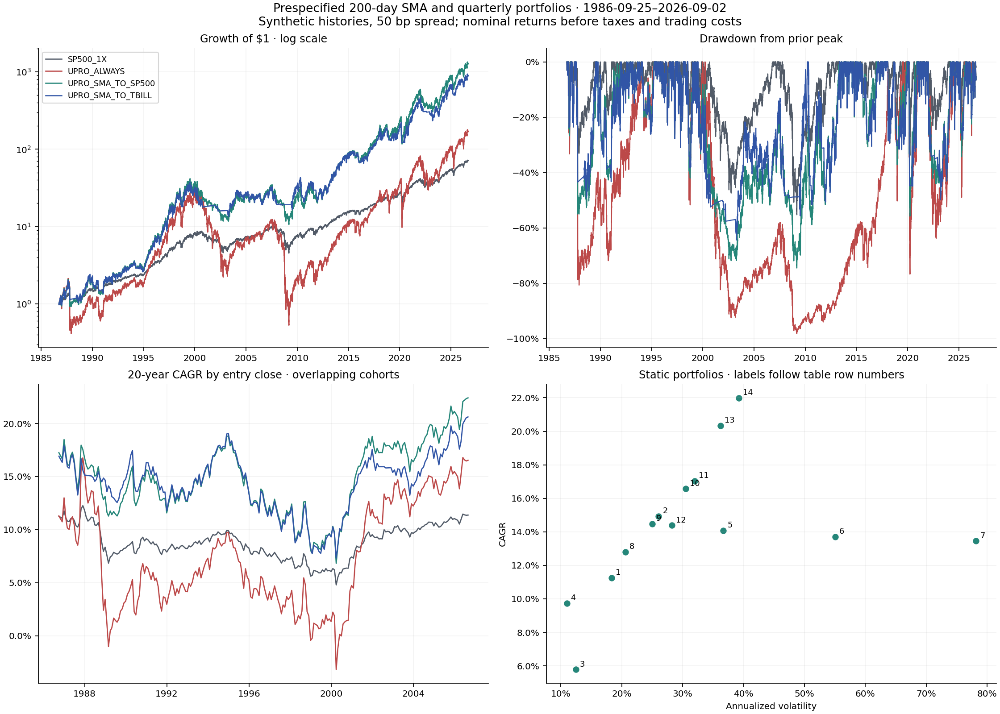

# Portfolio and 200-day SMA results

Data through **2026-09-02**. All main tables use the **same entry close, 1986-09-25, and endpoint, 2026-09-02**.
Baseline financing spread is 50 bp per borrowed dollar; synthetic BASE economics, nominal USD, before investor taxes and trading costs.
No weights, signals, or lookbacks were optimized. **200 days is primary; 150/250 days are robustness checks.**

**Core distinction:** UPRO → SP500 below SMA changes leverage while maintaining equity exposure.
UPRO → T-bills changes both leverage and equity exposure. These are different economic decisions.
The same distinction applies to SSO and TQQQ.

## Primary results

| Strategy | CAGR | Wealth × | Volatility | Max DD | Longest underwater (y) | Sharpe |
| --- | --- | --- | --- | --- | --- | --- |
| SP500_1X | 11.3% | 71.0 | 18.3% | -55.3% | 6.1 | 0.50 |
| SSO_ALWAYS | 14.1% | 192.9 | 36.7% | -88.4% | 14.5 | 0.46 |
| SSO_SMA_TO_SP500 | 15.8% | 351.0 | 27.5% | -62.6% | 7.2 | 0.56 |
| SSO_SMA_TO_TBILL | 14.8% | 245.1 | 23.7% | -44.9% | 7.8 | 0.57 |
| UPRO_ALWAYS | 13.7% | 169.5 | 55.0% | -98.2% | 18.4 | 0.46 |
| UPRO_SMA_TO_SP500 | 19.6% | 1,272.3 | 38.2% | -74.5% | 13.8 | 0.58 |
| UPRO_SMA_TO_TBILL | 18.5% | 888.4 | 35.6% | -64.4% | 10.7 | 0.57 |
| NASDAQ100_1X | 14.9% | 258.7 | 26.1% | -82.9% | 14.7 | 0.54 |
| TQQQ_ALWAYS | 13.5% | 154.5 | 78.2% | -99.982% | 26.4 | 0.52 |
| TQQQ_SMA_TO_NASDAQ | 22.2% | 2,995.9 | 57.6% | -97.9% | 19.9 | 0.58 |
| TQQQ_SMA_TO_TBILL | 19.9% | 1,424.8 | 54.4% | -95.6% | 18.3 | 0.55 |

- **SSO:** always leveraged CAGR 14.1%; rotate to 1× 15.8%; rotate to bills 14.8%. Maximum drawdowns are -88.4%, -62.6%, and -44.9%, respectively. Bills / 1× terminal wealth is 0.70× over the same dates.
- **UPRO:** always leveraged CAGR 13.7%; rotate to 1× 19.6%; rotate to bills 18.5%. Maximum drawdowns are -98.2%, -74.5%, and -64.4%, respectively. Bills / 1× terminal wealth is 0.70× over the same dates.
- **TQQQ:** always leveraged CAGR 13.5%; rotate to 1× 22.2%; rotate to bills 19.9%. Maximum drawdowns are -99.982%, -97.9%, and -95.6%, respectively. Bills / 1× terminal wealth is 0.48× over the same dates.

## Static portfolios: quarterly rebalancing

| Strategy | CAGR | Wealth × | Volatility | Max DD | Longest underwater (y) | Sharpe |
| --- | --- | --- | --- | --- | --- | --- |
| 1. SP500_100 | 11.3% | 71.0 | 18.3% | -55.3% | 6.1 | 0.50 |
| 2. NASDAQ100_100 | 14.9% | 258.7 | 26.1% | -82.9% | 14.7 | 0.54 |
| 3. LONG_TREASURY_100 | 5.8% | 9.4 | 12.5% | -48.1% | 6.1 | 0.26 |
| 4. CLASSIC_60_40 | 9.7% | 40.9 | 11.0% | -30.1% | 3.4 | 0.62 |
| 5. SSO_100 | 14.1% | 192.9 | 36.7% | -88.4% | 14.5 | 0.46 |
| 6. UPRO_100 | 13.7% | 169.5 | 55.0% | -98.2% | 18.4 | 0.46 |
| 7. TQQQ_100 | 13.5% | 154.5 | 78.2% | -99.982% | 26.4 | 0.52 |
| 8. SSO60_LT40 | 12.8% | 123.0 | 20.6% | -59.1% | 6.5 | 0.54 |
| 9. UPRO50_LT50 | 14.5% | 222.1 | 25.0% | -67.3% | 6.7 | 0.54 |
| 10. UPRO55_TMF45 | 16.6% | 456.5 | 30.5% | -70.5% | 4.8 | 0.55 |
| 11. UPRO60_TMF40 | 17.0% | 533.6 | 32.0% | -70.7% | 6.5 | 0.56 |
| 12. UPRO40_TMF60 | 14.4% | 214.4 | 28.2% | -75.3% | 4.8 | 0.51 |
| 13. TQQQ50_LT50 | 20.3% | 1,622.0 | 36.2% | -90.1% | 14.2 | 0.61 |
| 14. TQQQ50_TMF50 | 22.0% | 2,811.3 | 39.2% | -86.7% | 11.5 | 0.62 |

All 14 allocations are fixed in `letf.analysis.PORTFOLIOS`. The 1× long-Treasury sleeve is not cash.
Portfolio rebalancing is separate from daily leverage resets inside LETFs.

## Long-horizon entry dependence

### SMA strategies

| Strategy | 20y min CAGR | 20y median | 30y min CAGR | 30y median |
| --- | --- | --- | --- | --- |
| SP500_1X | 4.8% | 8.8% | 9.3% | 10.3% |
| SSO_ALWAYS | 2.3% | 9.0% | 10.1% | 12.8% |
| SSO_SMA_TO_SP500 | 6.1% | 12.3% | 12.6% | 14.6% |
| SSO_SMA_TO_TBILL | 6.6% | 12.2% | 12.1% | 13.8% |
| UPRO_ALWAYS | -3.2% | 6.1% | 7.7% | 12.4% |
| UPRO_SMA_TO_SP500 | 6.8% | 14.9% | 15.1% | 18.2% |
| UPRO_SMA_TO_TBILL | 7.3% | 14.8% | 14.7% | 17.4% |
| NASDAQ100_1X | 3.7% | 11.8% | 12.3% | 13.9% |
| TQQQ_ALWAYS | -16.5% | -1.7% | 4.0% | 9.9% |
| TQQQ_SMA_TO_NASDAQ | -2.0% | 13.5% | 14.8% | 20.0% |
| TQQQ_SMA_TO_TBILL | -2.2% | 13.2% | 13.5% | 18.1% |

### Static portfolios

| Strategy | 20y min CAGR | 20y median | 30y min CAGR | 30y median |
| --- | --- | --- | --- | --- |
| SP500_100 | 4.8% | 8.8% | 9.3% | 10.3% |
| NASDAQ100_100 | 3.7% | 11.8% | 12.3% | 13.9% |
| LONG_TREASURY_100 | 2.8% | 7.6% | 4.6% | 7.6% |
| CLASSIC_60_40 | 6.7% | 8.8% | 8.4% | 9.7% |
| SSO_100 | 2.3% | 9.0% | 10.1% | 12.8% |
| UPRO_100 | -3.2% | 6.1% | 7.7% | 12.4% |
| TQQQ_100 | -16.5% | -1.7% | 4.0% | 9.9% |
| SSO60_LT40 | 7.3% | 10.9% | 11.1% | 12.4% |
| UPRO50_LT50 | 7.8% | 12.2% | 12.5% | 14.1% |
| UPRO55_TMF45 | 11.7% | 16.4% | 14.6% | 18.0% |
| UPRO60_TMF40 | 10.9% | 16.3% | 15.0% | 18.2% |
| UPRO40_TMF60 | 11.2% | 16.0% | 12.6% | 17.3% |
| TQQQ50_LT50 | 7.1% | 16.9% | 17.5% | 19.7% |
| TQQQ50_TMF50 | 14.4% | 21.6% | 19.9% | 23.7% |

Monthly entry closes, first trading close on/after each exact 20/30-year anniversary.
The CSVs also contain maximum CAGR and minimum/median terminal wealth. Cohorts overlap;
they are **descriptive historical windows, not independent trials or future probabilities**.
Entries buy the ongoing strategy: static sleeve weights may have drifted since the last
scheduled rebalance; SMA positions inherit the pre-entry signal. No cohort restarts signal warm-up.

## Switching and state attribution

| Strategy | Leveraged days | Switches | Per year | On sessions | Off sessions | On-state CAGR | Off-state CAGR |
| --- | --- | --- | --- | --- | --- | --- | --- |
| SSO_SMA_TO_SP500 | 78.2% | 230 | 5.8 | 67.8 | 19.1 | 18.3% | 7.2% |
| SSO_SMA_TO_TBILL | 78.2% | 230 | 5.8 | 67.8 | 19.1 | 18.3% | 2.9% |
| UPRO_SMA_TO_SP500 | 78.2% | 230 | 5.8 | 67.8 | 19.1 | 23.3% | 7.2% |
| UPRO_SMA_TO_TBILL | 78.2% | 230 | 5.8 | 67.8 | 19.1 | 23.3% | 2.9% |
| TQQQ_SMA_TO_NASDAQ | 75.9% | 273 | 6.8 | 55.8 | 17.7 | 25.8% | 11.5% |
| TQQQ_SMA_TO_TBILL | 75.9% | 273 | 6.8 | 55.8 | 17.7 | 25.8% | 3.3% |

Fractions count trading sessions. Each state receives its entire close-to-close calendar
interval, including weekends. State CAGRs annualize compounded returns by **calendar time
spent in that state**, omitting all other periods; they are conditional, discontinuous-time
summaries, not standalone investable CAGRs. The CSV additionally gives additive annual log-growth
contributions. First/last episodes are included and may be censored. Initial allocation is
not a switch; a risk-on/off change counts once, not twice for selling and buying.

## Prespecified sensitivities

| Strategy | 150d CAGR | 200d CAGR | 250d CAGR | 0/50/100 bp CAGR | DD range, all 9 |
| --- | --- | --- | --- | --- | --- |
| SP500_1X | 11.3% | 11.3% | 11.3% | 11.3% / 11.3% / 11.3% | -55.3% to -55.3% |
| SSO_ALWAYS | 14.1% | 14.1% | 14.1% | 14.7% / 14.1% / 13.5% | -88.9% to -87.8% |
| SSO_SMA_TO_SP500 | 14.5% | 15.8% | 15.2% | 16.3% / 15.8% / 15.3% | -69.1% to -62.5% |
| SSO_SMA_TO_TBILL | 12.1% | 14.8% | 13.7% | 15.2% / 14.8% / 14.3% | -58.4% to -43.1% |
| UPRO_ALWAYS | 13.7% | 13.7% | 13.7% | 14.9% / 13.7% / 12.6% | -98.4% to -98.0% |
| UPRO_SMA_TO_SP500 | 16.9% | 19.6% | 18.4% | 20.6% / 19.6% / 18.7% | -84.0% to -70.2% |
| UPRO_SMA_TO_TBILL | 14.4% | 18.5% | 16.8% | 19.5% / 18.5% / 17.6% | -76.7% to -59.8% |
| NASDAQ100_1X | 14.9% | 14.9% | 14.9% | 14.9% / 14.9% / 14.9% | -82.9% to -82.9% |
| TQQQ_ALWAYS | 13.5% | 13.5% | 13.5% | 14.6% / 13.5% / 12.3% | -99.983% to -99.980% |
| TQQQ_SMA_TO_NASDAQ | 22.4% | 22.2% | 23.1% | 23.1% / 22.2% / 21.3% | -99.1% to -96.0% |
| TQQQ_SMA_TO_TBILL | 19.9% | 19.9% | 21.7% | 20.9% / 19.9% / 19.0% | -98.9% to -88.6% |

All lookbacks and financing spreads use identical dates and the same underlying signal.
Financing scenarios replace the leveraged sleeve **only while that sleeve is held**.
The full 3 × 3 grid, downside metrics, and 20/30-year summaries are in
`sma_financing_sensitivity.csv`. `sma_length_sensitivity.csv` contains the baseline-spread slice.

| Strategy | Monthly / quarterly / annual CAGR | 0 / 50 / 100 bp CAGR |
| --- | --- | --- |
| SP500_100 | 11.3% / 11.3% / 11.3% | 11.3% / 11.3% / 11.3% |
| NASDAQ100_100 | 14.9% / 14.9% / 14.9% | 14.9% / 14.9% / 14.9% |
| LONG_TREASURY_100 | 5.8% / 5.8% / 5.8% | 5.8% / 5.8% / 5.8% |
| CLASSIC_60_40 | 9.5% / 9.7% / 9.7% | 9.7% / 9.7% / 9.7% |
| SSO_100 | 14.1% / 14.1% / 14.1% | 14.7% / 14.1% / 13.5% |
| UPRO_100 | 13.7% / 13.7% / 13.7% | 14.9% / 13.7% / 12.6% |
| TQQQ_100 | 13.5% / 13.5% / 13.5% | 14.6% / 13.5% / 12.3% |
| SSO60_LT40 | 12.3% / 12.8% / 12.7% | 13.2% / 12.8% / 12.5% |
| UPRO50_LT50 | 13.4% / 14.5% / 14.1% | 15.1% / 14.5% / 13.9% |
| UPRO55_TMF45 | 14.3% / 16.6% / 15.6% | 17.8% / 16.6% / 15.4% |
| UPRO60_TMF40 | 14.7% / 17.0% / 16.1% | 18.2% / 17.0% / 15.8% |
| UPRO40_TMF60 | 12.5% / 14.4% / 13.6% | 15.6% / 14.4% / 13.2% |
| TQQQ50_LT50 | 17.7% / 20.3% / 22.1% | 21.0% / 20.3% / 19.7% |
| TQQQ50_TMF50 | 18.2% / 22.0% / 23.1% | 23.2% / 22.0% / 20.8% |

## Stress regimes

Episode windows are full calendar 1987, 2000–2002, 2007–2009, 2020, and 2022.
Peak-to-trough includes the close immediately before the episode and peaks reached inside it.
End/start is the compounded episode wealth ratio. Recovery follows the peak associated with
that episode's maximum drawdown and can occur after the episode ends; blank recovery means
not regained by 2026-09-02. A peak regained and subsequently lost again still counts as a recovery.
These episode drawdowns differ from a full-history underwater loss when an earlier peak
predates the episode. CSV fields separately give end wealth relative to the pre-episode
all-time peak and the first date that peak was regained. Static portfolios and extended
family windows are also included in `sma_regime_analysis.csv`.

### UPRO

| Episode | Strategy | Peak-to-trough | End / start | Peak recovered | Peak to recovery (y) |
| --- | --- | --- | --- | --- | --- |
| 1987 | SP500_1X | -33.1% | 1.05× | 1989-05-17 | 1.7 |
| 1987 | UPRO_ALWAYS | -80.7% | 0.63× | 1994-01-28 | 6.4 |
| 1987 | UPRO_SMA_TO_SP500 | -55.0% | 1.09× | 1989-07-31 | 1.9 |
| 1987 | UPRO_SMA_TO_TBILL | -43.4% | 1.19× | 1989-07-19 | 1.9 |
| 2000_2002 | SP500_1X | -47.4% | 0.62× | 2006-10-23 | 6.1 |
| 2000_2002 | UPRO_ALWAYS | -92.5% | 0.11× | 2018-08-29 | 18.4 |
| 2000_2002 | UPRO_SMA_TO_SP500 | -69.4% | 0.35× | 2013-03-11 | 13.2 |
| 2000_2002 | UPRO_SMA_TO_TBILL | -51.1% | 0.50× | 2007-07-13 | 7.5 |
| 2007_2009 | SP500_1X | -55.3% | 0.84× | 2012-04-02 | 4.5 |
| 2007_2009 | UPRO_ALWAYS | -95.7% | 0.21× | 2015-05-18 | 7.8 |
| 2007_2009 | UPRO_SMA_TO_SP500 | -69.4% | 0.90× | 2013-01-29 | 5.5 |
| 2007_2009 | UPRO_SMA_TO_TBILL | -48.9% | 1.26× | 2009-11-16 | 2.3 |
| 2020 | SP500_1X | -33.8% | 1.18× | 2020-08-10 | 0.5 |
| 2020 | UPRO_ALWAYS | -76.7% | 1.11× | 2021-01-07 | 0.9 |
| 2020 | UPRO_SMA_TO_SP500 | -55.7% | 1.28× | 2020-11-16 | 0.7 |
| 2020 | UPRO_SMA_TO_TBILL | -44.9% | 1.19× | 2020-12-17 | 0.8 |
| 2022 | SP500_1X | -24.5% | 0.82× | 2023-12-13 | 1.9 |
| 2022 | UPRO_ALWAYS | -63.7% | 0.44× | 2024-06-12 | 2.4 |
| 2022 | UPRO_SMA_TO_SP500 | -44.1% | 0.58× | 2024-03-01 | 2.2 |
| 2022 | UPRO_SMA_TO_TBILL | -39.4% | 0.62× | 2024-03-20 | 2.2 |
### SSO

| Episode | Strategy | Peak-to-trough | End / start | Peak recovered | Peak to recovery (y) |
| --- | --- | --- | --- | --- | --- |
| 1987 | SP500_1X | -33.1% | 1.05× | 1989-05-17 | 1.7 |
| 1987 | SSO_ALWAYS | -60.8% | 0.89× | 1991-04-17 | 3.6 |
| 1987 | SSO_SMA_TO_SP500 | -44.9% | 1.08× | 1989-07-19 | 1.9 |
| 1987 | SSO_SMA_TO_TBILL | -30.7% | 1.17× | 1989-05-22 | 1.7 |
| 2000_2002 | SP500_1X | -47.4% | 0.62× | 2006-10-23 | 6.1 |
| 2000_2002 | SSO_ALWAYS | -78.9% | 0.28× | 2014-09-05 | 14.5 |
| 2000_2002 | SSO_SMA_TO_SP500 | -59.5% | 0.47× | 2007-05-18 | 7.2 |
| 2000_2002 | SSO_SMA_TO_TBILL | -33.6% | 0.67× | 2004-01-21 | 4.1 |
| 2007_2009 | SP500_1X | -55.3% | 0.84× | 2012-04-02 | 4.5 |
| 2007_2009 | SSO_ALWAYS | -84.5% | 0.48× | 2013-10-22 | 6.0 |
| 2007_2009 | SSO_SMA_TO_SP500 | -62.6% | 0.88× | 2012-09-13 | 5.2 |
| 2007_2009 | SSO_SMA_TO_TBILL | -34.2% | 1.24× | 2009-10-14 | 2.3 |
| 2020 | SP500_1X | -33.8% | 1.18× | 2020-08-10 | 0.5 |
| 2020 | SSO_ALWAYS | -59.2% | 1.22× | 2020-09-02 | 0.5 |
| 2020 | SSO_SMA_TO_SP500 | -45.7% | 1.25× | 2020-09-01 | 0.5 |
| 2020 | SSO_SMA_TO_TBILL | -32.2% | 1.16× | 2020-12-01 | 0.8 |
| 2022 | SP500_1X | -24.5% | 0.82× | 2023-12-13 | 1.9 |
| 2022 | SSO_ALWAYS | -46.6% | 0.61× | 2024-02-22 | 2.1 |
| 2022 | SSO_SMA_TO_SP500 | -34.8% | 0.69× | 2024-02-07 | 2.1 |
| 2022 | SSO_SMA_TO_TBILL | -27.5% | 0.74× | 2024-02-22 | 2.1 |
### TQQQ

| Episode | Strategy | Peak-to-trough | End / start | Peak recovered | Peak to recovery (y) |
| --- | --- | --- | --- | --- | --- |
| 1987 | NASDAQ100_1X | -39.9% | 1.10× | 1989-05-26 | 1.6 |
| 1987 | TQQQ_ALWAYS | -83.8% | 0.78× | 1992-01-14 | 4.3 |
| 1987 | TQQQ_SMA_TO_NASDAQ | -56.8% | 1.31× | 1991-04-02 | 3.5 |
| 1987 | TQQQ_SMA_TO_TBILL | -38.3% | 1.44× | 1991-04-02 | 3.5 |
| 2000_2002 | NASDAQ100_1X | -82.9% | 0.27× | 2014-11-26 | 14.7 |
| 2000_2002 | TQQQ_ALWAYS | -99.955% | 0.00× | Unrecovered | — |
| 2000_2002 | TQQQ_SMA_TO_NASDAQ | -97.4% | 0.05× | 2020-02-04 | 19.9 |
| 2000_2002 | TQQQ_SMA_TO_TBILL | -93.7% | 0.11× | 2018-07-13 | 18.3 |
| 2007_2009 | NASDAQ100_1X | -53.4% | 1.08× | 2010-12-08 | 3.1 |
| 2007_2009 | TQQQ_ALWAYS | -95.1% | 0.43× | 2013-10-18 | 6.0 |
| 2007_2009 | TQQQ_SMA_TO_NASDAQ | -73.9% | 1.27× | 2012-03-19 | 4.4 |
| 2007_2009 | TQQQ_SMA_TO_TBILL | -63.2% | 1.55× | 2010-03-23 | 2.4 |
| 2020 | NASDAQ100_1X | -28.0% | 1.49× | 2020-06-03 | 0.3 |
| 2020 | TQQQ_ALWAYS | -69.9% | 2.11× | 2020-07-10 | 0.4 |
| 2020 | TQQQ_SMA_TO_NASDAQ | -58.6% | 2.22× | 2020-07-08 | 0.4 |
| 2020 | TQQQ_SMA_TO_TBILL | -55.0% | 2.05× | 2020-07-20 | 0.4 |
| 2022 | NASDAQ100_1X | -34.8% | 0.68× | 2023-12-12 | 1.9 |
| 2022 | TQQQ_ALWAYS | -80.8% | 0.21× | 2024-07-05 | 2.5 |
| 2022 | TQQQ_SMA_TO_NASDAQ | -57.0% | 0.46× | 2023-12-13 | 1.9 |
| 2022 | TQQQ_SMA_TO_TBILL | -45.8% | 0.57× | 2023-07-13 | 1.5 |

## Longer family windows (separate comparisons)

| Window | Entry | Strategy | CAGR | Max DD |
| --- | --- | --- | --- | --- |
| SP500_extended | 1980-12-26 | SP500_1X | 11.2% | -55.3% |
| SP500_extended | 1980-12-26 | SSO_ALWAYS | 13.0% | -88.4% |
| SP500_extended | 1980-12-26 | SSO_SMA_TO_SP500 | 15.3% | -62.6% |
| SP500_extended | 1980-12-26 | SSO_SMA_TO_TBILL | 15.1% | -44.9% |
| SP500_extended | 1980-12-26 | UPRO_ALWAYS | 11.9% | -98.2% |
| SP500_extended | 1980-12-26 | UPRO_SMA_TO_SP500 | 18.7% | -74.5% |
| SP500_extended | 1980-12-26 | UPRO_SMA_TO_TBILL | 18.5% | -64.4% |
| NASDAQ100_extended | 1986-09-25 | NASDAQ100_1X | 14.9% | -82.9% |
| NASDAQ100_extended | 1986-09-25 | TQQQ_ALWAYS | 13.5% | -99.982% |
| NASDAQ100_extended | 1986-09-25 | TQQQ_SMA_TO_NASDAQ | 22.2% | -97.9% |
| NASDAQ100_extended | 1986-09-25 | TQQQ_SMA_TO_TBILL | 19.9% | -95.6% |

Do not compare terminal wealth between these windows and the common-window tables.
All comparisons within a window share dates across all three lookbacks, after the 250-level
warm-up; that deliberately discards some otherwise available 150/200-day history.

## Interpretation

SSO: 1× rotation adds 1.7 percentage points to CAGR; bills add 0.7 points. Choosing bills over 1× costs 1.0 points of CAGR and reduces full-period wealth by 30%.

UPRO: 1× rotation adds 5.9 percentage points to CAGR; bills add 4.8 points. Choosing bills over 1× costs 1.1 points of CAGR and reduces full-period wealth by 30%.

TQQQ: 1× rotation adds 8.7 percentage points to CAGR; bills add 6.5 points. Choosing bills over 1× costs 2.3 points of CAGR and reduces full-period wealth by 52%.

The strongest result here supports **timing leverage intensity while retaining equity exposure**.
At 200 days, both rotations improve CAGR and drawdown versus always-leveraged exposure in
all three families. Staying in 1× equities produces more full-period wealth than bills in
every tested length/spread combination, including the extended S&P window. This ordering
is not universal across entry cohorts: bills have slightly better worst 20-year S&P CAGRs,
while the 1× versions have higher median 30-year outcomes. Bill protection therefore has
an opportunity cost relative to 1× rotation, even though primary-rule CAGR exceeds always-on
leverage. TQQQ's primary rotated drawdowns remain about 96–98%; a higher terminal CAGR
should not obscure the long recovery or the negative worst 20-year cohorts.

Leveraged stock/bond mixes are not uniformly superior. UPRO55_TMF45 and UPRO60_TMF40 produce 16.6% and 17.0% CAGR versus 12.8% for SSO60_LT40 and 14.5% for UPRO50_LT50, but their maximum drawdowns are -70.5% / -70.7% versus -59.1% / -67.3%. The more bond-heavy UPRO40_TMF60 does not improve on UPRO50_LT50 in either full-period CAGR or maximum drawdown. TQQQ/bond combinations achieve higher historical CAGR but still have extreme drawdowns. These are different total leverage and risk exposures, not controlled estimates of a diversification premium.

Across all nine length/spread combinations, UPRO and TQQQ rotations retain higher CAGR
and smaller drawdowns than always-on leverage. SSO → 1× also retains a CAGR advantage,
but **SSO → bills does not**: 150 days underperforms always-on SSO across spreads, and
250 days also underperforms on the common window. Thus the 2× bill-rotation growth result
is sensitive to the SMA rule. The precise 200-day return advantage is not a universal
property of trend following. The 55/45 and 60/40 UPRO/TMF mixes retain their CAGR lead over
SSO60_LT40 and UPRO50_LT50 in the quarterly financing scenarios, with greater downside.
Rebalancing frequency materially changes outcomes (especially TQQQ combinations); the
quarterly primary result is a specification, not a selected winner. Absolute returns remain
conditional on historical proxies, funding/fee assumptions, and frictionless execution.

## Definitions and safeguards

- Signal: trailing N **observed 1× total-return levels**, including the initial entry-close
  level; close > SMA is risk-on and equality is risk-off. The first position is on the
  session after the Nth level. Position for return t uses only signal t−1. Missing internal
  sessions raise an error rather than being dropped. Execution at the signal close with
  exposure for the next close-to-close return is an idealized daily-bar convention; actual
  close auction timing, overnight moves and slippage require execution-level validation.
- CAGR uses elapsed calendar days / 365.25. Volatility uses daily sample SD × √252.
  Sharpe is mean daily strategy-minus-bill return / its sample SD × √252.
  Best/worst calendar years exclude partial endpoint years. Worst rolling 1/5/10-year CAGR
  considers every eligible daily entry and the first close on/after its anniversary.
- Underwater duration is elapsed calendar time from a high-water mark through recovery,
  including an unrecovered spell through the final close. Maximum-drawdown recovery is
  reported from both peak and trough. Wealth paths include the initial $1, so a loss on
  the first return counts. No missing duration is interpreted as zero.
- **Path-compounding drag** is the gap between ideal daily leveraged log growth and
  leverage times underlying log growth; it is not another fee. **Financing and expense drag**
  is the separate gap between ideal and costed LETF returns, as in the existing decomposition.
- **Leverage timing** is represented by LETF → 1×. The incremental **equity-market timing**
  comparison is LETF → bills versus LETF → 1×: both hold the identical LETF on risk-on days,
  so their log-wealth difference arises entirely on risk-off days. The two variants do not
  by themselves identify timing skill separately from lower average leverage; an exposure-
  matched counterfactual would be needed for that stronger claim.
- **Diversification/rebalancing effects** arise from combining stock/bond sleeves and
  periodically restoring weights. Compare the fixed portfolios and rebalance sensitivities;
  do not ascribe their gains to removing financing costs or volatility drag.
- Existing validation is unchanged. Its holdout validates approximate ETF reconstruction,
  **not** out-of-sample SMA performance. The present strategy comparison is a historical
  backtest on the full archive; choosing it in advance of this run does not make the past
  unseen data. Trading spreads, turnover costs, investor taxes and implementation delays
  are absent. Switch counts help scope those still-unvalidated costs.
- Existing proxies carry through: pre-1988 S&P uses grossed-up VFINX; pre-1999 Nasdaq is
  price-only (so early Nasdaq signals cannot be claimed to use a true observed TR index);
  pre-July-2002 long Treasury uses duration-mismatched VUSTX. Large TMF outcomes are particularly
  dependent on that proxy and the long historical bond bull market. Current fixed expense
  ratios, funding proxy, fund survival, and extreme-day behavior remain model assumptions.

## T-bill source and accrual

`TBILL_3M_1X` uses daily [FRED DTB3](https://fred.stlouisfed.org/series/DTB3), sourced from
Federal Reserve H.15, a **discount-basis** annualized rate. This is distinct from the
existing DFF borrowing proxy. No splice is needed over the equity history.
Following the [Treasury bill pricing convention](https://www.treasurydirect.gov/marketable-securities/understanding-pricing/),
for decimal discount quote d and assumed 91-day maturity:

`P / face = 1 − d × 91 / 360; daily carry = ((face / P) − 1) / 91`.

For each calendar day, use the most recent nonmissing observation dated no later than the
previous calendar date, with forward carry across holidays; compound `(1 + daily carry)`
through the next trading close. The fixed 91-day tenor and daily reinvestment are explicit
proxy assumptions. This is accrued cash carry, **not a marked-to-market 3-month bond index**;
it omits bill price changes, fees and trading costs. The cached historical series is not a
vintage-by-vintage record of intraday publication availability.
Raw cash bytes, URL, timestamp and SHA-256 are in `source_manifest.json`; analysis input hashes,
configuration hash and frozen input-bundle hash are in `portfolio_sma_manifest.json`.

## Reproduce and inspect

```bash
PYTHONPATH=src python -m unittest discover -s tests -v
PYTHONPATH=src python -m letf.analysis --offline
```

A clean clone can rebuild this analysis offline from `data/snapshots/portfolio_sma_inputs.zip`.
It restores only the existing daily-return archive and raw DTB3 cache, verifies their hashes,
and does not regenerate underlying histories. Existing processed inputs are never overwritten.
For a deliberately updated analysis, first rebuild underlying series with the existing pipeline,
then run `python -m letf.analysis --refresh` to refresh cash and capture the new input bundle.
Default online analysis downloads only DTB3 when missing and reuses cached daily histories.

Compact metrics and sensitivity CSVs are under `reports/`. Daily portfolio/rotation returns,
positions, cash returns, and individual cohort rows are generated under `data/processed/`.
All return fields are decimal units; wealth is a multiple of starting capital.


