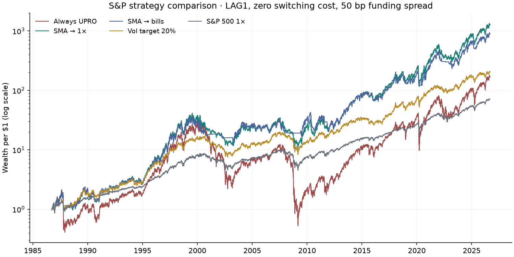
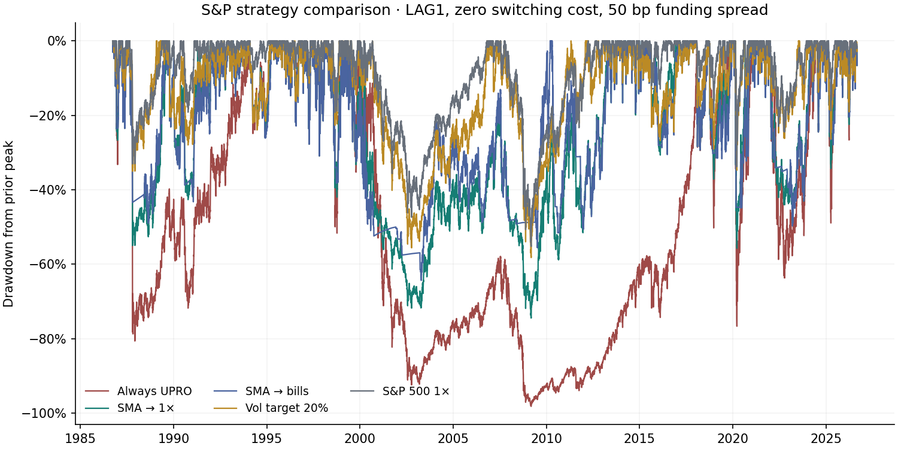
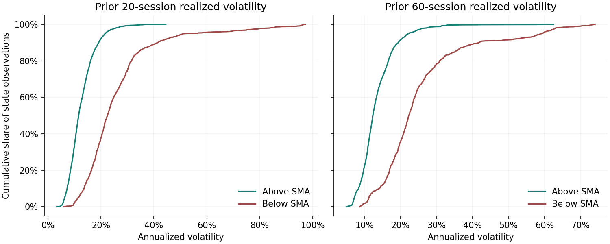
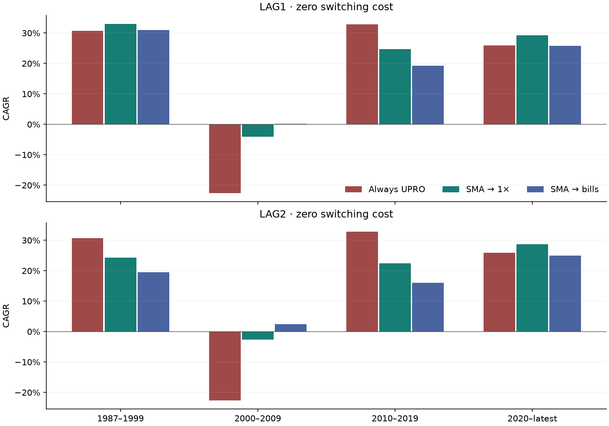

# SMA falsification results

**Verdict: UPRO → 1× remains a candidate for further study, but its outperformance is not robust under the full battery.**
It survives the extra session at zero, 10 and 25 bp per switch; at 50 bp **combined with delay** its CAGR falls below always-on UPRO.
The weaker claim—1× risk-off produces more full-history wealth than T-bills—survives the parameter grid,
but reverses in 2000–2009. Neither claim meets the requested “Robust” standard across historical subperiods.
Execution timing materially changes the magnitude, especially around the 1987 crash.

**Before quoting any advantage below:** `reports/signal_null_model_results.md`
tests these strategies against a null with the same switch count, episode
lengths and leveraged-day fraction but randomized timing. None is significant
at 5% after correcting for the 144 nuisance-parameter cells searched here, and
every one has a top-20-session share above 100% of its total advantage — the
remaining ~10,000 sessions are net negative.

Matched primary entry close **1986-09-26**, through **2026-09-02**. Nominal wealth per $1;
no contributions, withdrawals or investor taxes. The existing synthetic returns, cash accrual, funding assumptions,
portfolio/SMA framework and validation are unchanged. The prior common portfolio window is retained, with sufficient
warm-up for both lags and all three SMA lengths. No parameter was optimized.

## Direct answers

1. **Additional execution day:** UPRO → 1× CAGR falls from 19.6% to 16.8%, versus 13.7% always-on.
   Wealth falls from 1,266.8× to 496.5×. Only **29.9%**
   of excess terminal wealth survives (53.5% of excess log wealth). This is material timing sensitivity.
2. **Switching friction:** the 200-day UPRO → 1× rule survives 10/25 bp under either lag and 50 bp under LAG1;
   LAG2 + 50 bp reverses the advantage. SSO is more fragile: even LAG2 + 10 bp loses to always-on SSO.
   These are specified cost scenarios, not estimates of actual historical execution costs.
3. **Distinct environments:** LAG1 UPRO → 1× wins three of four blocks; LAG2 wins two.
   Both lose in 2010–2019 and over 2010–latest. The 2000–2009 bear markets generate most of the net log-wealth benefit.
4. **Signal source:** price and total-return signals differ on about 2.67% of matched S&P days.
   The 1×-versus-bills ordering persists, but CAGR magnitude changes. A separate full-archive comparison
   includes 1987: price-SMA delayed CAGR is 19.1%, versus 16.8% for the existing TR signal. The price
   crossing occurs one session earlier before Black Monday; this early comparison also changes proxy construction.
5. **Volatility/leverage economics:** below-SMA days have roughly twice the prior realized volatility.
   Their average arithmetic equity return remains positive, while synthetic UPRO's average log return is negative.
   This supports an unfavorable-leverage-regime interpretation, not simply “stocks tend to fall below trend.”
6. **Explicit volatility alternatives:** the discrete 20% target achieves lower drawdown with much lower average exposure,
   but does not reproduce most of the LAG1 wealth gain. The binary rule reproduces part of the gain with comparable
   average exposure, yet has a much deeper drawdown. Neither comparator identifies a unique causal mechanism.
7. **Attribution:** exact log accounting shows path-compounding and financing savings more than offset forgone leveraged
   equity growth. Positive below-SMA 1× equity growth is worth more than bill carry over the full sample.
8. **1× versus bills:** stronger full-history wealth robustness for 1×, not universal dominance. Bills do better in
   2000–2009, and can improve some worst 20-year cohorts. Drawdown ordering can change under delay.
9. **Thesis:** evidence remains consistent with leverage timing and weakens the case for exiting equities entirely,
   but does not prove timing skill or that SMA is primarily a volatility filter. The candidate remains research-worthy;
   a strong claim of reliable superiority is falsified by the joint cost/delay and regime tests.

## Execution and costs

LAG1 = `IMMEDIATE_NEXT_RETURN`: signal at close t controls return ending t+1.
LAG2 = `WAIT_ONE_TRADING_DAY`: the same signal controls return ending t+2, with the old position retained through t+1.
The extra delay applies symmetrically to entry and exit; it is not a bid/ask charge. LAG1 remains an idealized
close-based convention, not demonstrated after-close execution at the already observed price.


| Strategy | CAGR L1 | CAGR L2 | Wealth L1 | Wealth L2 | Max DD L1 | Max DD L2 |
| --- | --- | --- | --- | --- | --- | --- |
| SSO_ALWAYS | 14.1% | 14.1% | 192.3 | 192.3 | -88.4% | -88.4% |
| SSO_SMA_TO_SP500 | 15.8% | 14.6% | 350.0 | 233.9 | -62.6% | -64.1% |
| SSO_SMA_TO_TBILL | 14.8% | 12.7% | 244.4 | 117.1 | -44.9% | -60.6% |
| UPRO_ALWAYS | 13.7% | 13.7% | 168.7 | 168.7 | -98.2% | -98.2% |
| UPRO_SMA_TO_SP500 | 19.6% | 16.8% | 1,266.8 | 496.5 | -74.5% | -78.2% |
| UPRO_SMA_TO_TBILL | 18.5% | 14.8% | 884.6 | 248.7 | -64.4% | -80.1% |


Each stated cost is charged **once per allocation transition**, covering the portfolio sale/purchase implementation.
An off/on cycle entails two charges: 50 bp per switch costs 99.75 bp per complete cycle. Initial allocation has no
switch charge. Daily net growth is `(1 + gross return) × (1 − cost × transition)`.
Thus “round-trip implementation” describes completing one sleeve replacement, not an entire off/on signal cycle.
No fee is charged for merely remaining below or above SMA. UPRO's 200-day rule switches 230 times, about 5.8/year;
at 50 bp the cost-only terminal wealth factor is `(0.995)^230 = 0.316`.


| Strategy | Execution | 0 bp | 10 bp | 25 bp | 50 bp |
| --- | --- | --- | --- | --- | --- |
| SSO_SMA_TO_SP500 | LAG1 | 15.8% | 15.1% | 14.1% | 12.5% |
| SSO_SMA_TO_SP500 | LAG2 | 14.6% | 14.0% | 13.0% | 11.4% |
| SSO_SMA_TO_TBILL | LAG1 | 14.8% | 14.1% | 13.1% | 11.5% |
| SSO_SMA_TO_TBILL | LAG2 | 12.7% | 12.0% | 11.1% | 9.5% |
| UPRO_SMA_TO_SP500 | LAG1 | 19.6% | 18.9% | 17.9% | 16.2% |
| UPRO_SMA_TO_SP500 | LAG2 | 16.8% | 16.1% | 15.1% | 13.5% |
| UPRO_SMA_TO_TBILL | LAG1 | 18.5% | 17.8% | 16.8% | 15.1% |
| UPRO_SMA_TO_TBILL | LAG2 | 14.8% | 14.2% | 13.2% | 11.5% |


All volatility, cash-excess Sharpe, underwater durations, switches, daily-entry worst 5/10/20/30-year CAGRs,
and monthly-entry 20/30-year cohort minima/medians are in the execution and cost CSVs. Percentage of benefit retained
is `100 × (W_delayed − W_always)/(W_immediate − W_always)`, holding costs fixed; log retention uses log wealth ratios.
It is undefined for always-on and may be negative. Finite overlapping cohorts are not independent observations.

## Non-overlapping periods

UPRO CAGR at zero switching cost and 50 bp financing spread:


| Period | Lag | 1× | Always 3× | SMA → 1× | SMA → bills |
| --- | --- | --- | --- | --- | --- |
| 1987_1999 | LAG1 | 18.0% | 30.7% | 33.0% | 31.0% |
| 1987_1999 | LAG2 | 18.0% | 30.7% | 24.3% | 19.5% |
| 2000_2009 | LAG1 | -0.9% | -22.7% | -4.1% | 0.2% |
| 2000_2009 | LAG2 | -0.9% | -22.7% | -2.7% | 2.5% |
| 2010_2019 | LAG1 | 13.6% | 32.8% | 24.8% | 19.2% |
| 2010_2019 | LAG2 | 13.6% | 32.8% | 22.5% | 16.0% |
| 2020_latest | LAG1 | 15.5% | 25.9% | 29.2% | 25.8% |
| 2020_latest | LAG2 | 15.5% | 25.9% | 28.7% | 25.0% |
| 2010_latest | LAG1 | 14.3% | 30.0% | 26.5% | 21.8% |
| 2010_latest | LAG2 | 14.3% | 30.0% | 24.9% | 19.5% |


The first four rows per lag partition 1987–latest; 2010–latest combines the last two, not another independent observation.
The longer three-block view reuses 1987–1999 and 2000–2009. CSVs retain both benchmark wealth ratios,
terminal multiples, volatility, Sharpe and drawdowns for SSO and secondary TQQQ too. Returns ending inside each
interval are included; the immediately preceding close supplies initial capital. Signals never restart at boundaries.
Early Nasdaq results retain the pre-1999 price-only proxy limitation.


LAG1: 2000–2009 contributes **2.149 log units** versus 2.016 for the entire matched history; the rest contributes -0.133. This concentration limits the broad robustness claim.


LAG2: 2000–2009 contributes **2.299 log units** versus 1.079 for the entire matched history; the rest contributes -1.219. This concentration limits the broad robustness claim.


## Price versus total-return SMA


| Lag | Signal | Entry close | CAGR | Max DD | Wealth | 20y min | 30y min |
| --- | --- | --- | --- | --- | --- | --- | --- |
| LAG1 | TOTAL_RETURN_SMA | 1988-10-18 | 20.1% | -74.5% | 1,037.5 | 6.8% | 15.6% |
| LAG1 | PRICE_SMA | 1988-10-18 | 18.7% | -75.5% | 667.5 | 5.7% | 14.4% |
| LAG2 | TOTAL_RETURN_SMA | 1988-10-18 | 19.4% | -71.9% | 836.3 | 7.6% | 14.9% |
| LAG2 | PRICE_SMA | 1988-10-18 | 19.7% | -73.3% | 912.4 | 8.8% | 15.7% |


Only the SMA input changes: Yahoo S&P 500 `^GSPC` / Nasdaq-100 `^NDX` close prices versus archived underlying TR levels.
Sources are frozen with URLs and SHA-256 in `sma_price_input_manifest.json`; no open/intraday data were introduced.
The observed-TR-only S&P test begins after a full 200-close post-1988 warm-up; Nasdaq after a post-March-1999 warm-up.
All source/lag comparisons within a family use identical dates. Nasdaq lacks a 30-year eligible cohort, so it is blank,
not zero. `differing_switch_dates` counts dates on which one source switches and the other does not, distinct from the
net difference in switch counts. A smaller signal-disagreement fraction does not guarantee small performance differences.


The companion full-archive S&P test includes 1987, retaining the original VFINX TR proxy before 1988:

| Lag | Signal | CAGR | Max DD | Wealth |
| --- | --- | --- | --- | --- |
| LAG1 | TOTAL_RETURN_SMA | 19.6% | -74.5% | 1,266.8 |
| LAG1 | PRICE_SMA | 18.2% | -75.5% | 795.5 |
| LAG2 | TOTAL_RETURN_SMA | 16.8% | -78.2% | 496.5 |
| LAG2 | PRICE_SMA | 19.1% | -73.3% | 1,066.7 |

The early invested-return proxy is unchanged. In 1987, price crosses on **October 15** and the existing TR proxy on **October 16**. The earlier price signal lets LAG2 exit before Black Monday. Price-SMA LAG2 improves CAGR relative to its own LAG1, so delay is not uniformly pessimistic. Before 1988 this is also a price-index-versus-fund-proxy comparison, not an isolated dividend experiment. The numerical execution penalty is therefore fragile to signal construction; the clean post-1988 comparison remains separate.

## Volatility and attribution


| Trailing sessions | Prior SMA state | Mean vol | Median vol | 25th / 75th | Share of top-decile days |
| --- | --- | --- | --- | --- | --- |
| 20 | above | 12.6% | 11.6% | 9.1% / 15.2% | 16.4% |
| 20 | below | 26.2% | 22.5% | 17.6% / 30.0% | 83.6% |
| 60 | above | 13.4% | 12.3% | 10.3% / 15.7% | 23.7% |
| 60 | below | 25.7% | 22.3% | 18.0% / 28.7% | 76.3% |


Volatility is sample SD × √252 using returns through the prior close; today's return cannot change today's state or estimate.
The highest-volatility decile is a full-sample descriptive cutoff, not a trading threshold. Approximate UPRO path drag
(`3 × r²`, annualized by 252) is about 5.4% above versus 27.0% below SMA; exact log path drag is 5.5% versus 28.9%.
Annualized conditional financing log drag is about 7.8% above versus 7.3% below: higher financing rates are **not**
what distinguishes below-SMA days. Staying 1× saves borrowing costs anyway. Conditional arithmetic means remain positive:
S&P about 0.050% above / 0.046% below per day; UPRO 0.116% / 0.105%. UPRO log means are 0.083% / −0.064%.
These are conditional descriptions, not forecasts or annual holding-period returns.

Exact UPRO advantage versus always-on, contributed on executed risk-off days (cumulative natural-log units, before switching costs):


| Risk-off | Lag | Path saved | Funding saved | Fees saved | Equity exposure change | Bills earned | Total |
| --- | --- | --- | --- | --- | --- | --- | --- |
| SP500 | LAG1 | +2.519 | +0.633 | +0.078 | -1.214 | +0.000 | +2.016 |
| TBILL | LAG1 | +2.519 | +0.633 | +0.078 | -1.820 | +0.248 | +1.657 |
| SP500 | LAG2 | +2.250 | +0.627 | +0.078 | -1.875 | +0.000 | +1.079 |
| TBILL | LAG2 | +2.250 | +0.627 | +0.078 | -2.813 | +0.246 | +0.388 |


Identity: `log(1+LETF) = L log(1+r) − path_drag − financing_drag − expense_drag`.
Financing is inferred from the unchanged synthetic daily-return accounting, including funding plus spread; the known
expense accrual is separated. Financing is removed before expense in the exact log decomposition. Path is an algebraic
compounding gap, not a paid fee or an independently identified causal effect.

For LAG1 UPRO → 1×, avoiding 3× equity contributes −1.820 log units, retaining 1× contributes +0.607,
and the net equity-exposure contribution is −1.214. Reduced leverage forgoes **net positive** underlying growth;
it wins because path (+2.519), financing (+0.633) and expense (+0.078) savings are larger.
UPRO → bills also forgoes the +0.607 of 1× equity, earning +0.248 in bills instead.
The CSV splits avoided negative-equity days from forgone positive-equity days, but those large gross contributions
must be netted; percentages of a small net benefit are misleading. Above-SMA relative contribution is exactly zero.
Actual-minus-explained residuals are at floating-point precision. Retained historical equity growth is not an estimate
of an expected future equity risk premium.


## Fixed volatility-rule comparators


| Strategy | CAGR 0bp | CAGR 25bp | Max DD 0bp | Mean exposure | Switches |
| --- | --- | --- | --- | --- | --- |
| SP500_1X | 11.3% | 11.3% | -55.3% | 1.00× | 0 |
| UPRO_ALWAYS | 13.7% | 13.7% | -98.2% | 3.00× | 0 |
| UPRO_SMA_TO_SP500 | 19.6% | 17.9% | -74.5% | 2.56× | 230 |
| UPRO_SMA_TO_TBILL | 18.5% | 16.8% | -64.4% | 2.35× | 230 |
| VOL_TARGET_20 | 14.3% | 10.5% | -58.2% | 1.63× | 529 |
| VOL_BINARY | 17.4% | 15.8% | -89.7% | 2.60× | 219 |


The discrete rule maps `clip(20% / prior-20-day vol, 1, 3)` to 1× below 1.5, 2× from 1.5 to below 2.5, and 3× otherwise.
It is an exposure bucket approximation, so realized portfolio volatility need not equal 20%. Binary uses UPRO below
20% realized vol and 1× otherwise. Both are lagged and neither threshold nor lookback was searched.
Binary reproduces 63% of LAG1 SMA → 1×'s **excess log wealth**, with comparable average exposure,
but its drawdown is much worse. The target's low exposure and frequent switches confound mechanism comparisons;
its results cannot alone show that volatility filtering explains or refutes SMA's benefit.

## Stress events and delayed exits

UPRO → 1×, wealth rebased to $1 at the close preceding each episode. “Loss before signal” is from the highest
portfolio value within the episode through the first new below-SMA crossing; it includes losses on the signal day.


| Episode | First sell signal | Loss before signal | DD L1 | DD L2 | Worst single-exit delay loss (signal) |
| --- | --- | --- | --- | --- | --- |
| 1987 | 1987-10-16 | 43.4% | -55.0% | -78.2% | 51.6% (1987-10-16) |
| 2000_2002 | 2000-02-18 | 25.9% | -69.4% | -67.9% | 3.0% (2000-02-24) |
| 2007_2009 | 2007-08-03 | 22.4% | -69.4% | -71.9% | 3.3% (2008-05-20) |
| 2020 | 2020-02-27 | 32.8% | -55.7% | -48.1% | 3.5% (2020-03-05) |
| 2022 | 2022-01-21 | 23.2% | -44.1% | -48.5% | 5.1% (2022-12-14) |


**1987 dominates the execution warning:** the Friday October 16 signal precedes Black Monday. Waiting through Monday
reduces wealth by another 51.6% relative to immediate UPRO → 1× exit over that session. The portfolio had already lost
43.4% from its episode peak before the signal. This uses the original pre-1988 grossed VFINX proxy and is especially
sensitive to its crash-date accuracy. No crash avoidance should be assumed before a signal exists.
Delay is not uniformly worse: 2020 episode drawdown and ending wealth improve here with LAG2 because of the full
sequence of delayed buy and sell decisions, despite adverse individual delayed exits.

`stress_event_detail` reports every S&P rotation and always-on comparator, signal/actual execution/first affected return dates,
value at signal, subsequent minimum, first re-entry, all switches, episode end and eventual recovery.
A whipsaw is explicitly a reversal within 10 sessions of the preceding switch; all switches remain separately reported.
First re-entry may be brief and outside the episode. Already-below-at-start is flagged; it is not invented as a fresh sell signal.
Always-on signal fields are reference SMA crossings, not trades. Recovery follows the episode's maximum-drawdown trough
back to its associated episode peak, including history after the episode. Blank means not observed, not instant recovery.
The companion transition CSV lists **every** sell signal within each stress episode and its next-session loss; positive
values mean waiting hurt, negative values mean it helped. These single-exit effects are not added as if independent.

## Robustness classification


| Full-history CAGR claim | Positive grid cells | Min CAGR gap | Max CAGR gap |
| --- | --- | --- | --- |
| SSO → 1× beats always-on | 29/72 | -4.6% | 1.8% |
| SSO → 1× beats bills | 72/72 | 1.0% | 2.4% |
| UPRO → 1× beats always-on | 61/72 | -2.1% | 6.1% |
| UPRO → 1× beats bills | 72/72 | 1.0% | 2.5% |


Grid = 150/200/250 sessions × 0/50/100 bp financing × LAG1/LAG2 × 0/10/25/50 bp switching costs.
The 72 cells per comparison reuse one history and are **not** 72 independent confirmations.

- **Robust descriptive association:** below-SMA states have higher prior realized volatility at both specified windows.
  This does not assert a robust causal strategy edge.
- **Moderately robust, conditional:** UPRO → 1× improves full-history wealth under either lag with 0–25 bp switching cost
  across tested lengths/spreads. Magnitude depends materially on timing, and it loses in some historical regimes.
- **Fragile as a universal outperformance claim:** joint delay/50 bp tests reverse UPRO's advantage; SSO reverses even
  under milder friction. Both UPRO lag versions underperform always-on over 2010–latest.
- **Moderately robust full-history 1×-over-bills ranking; fragile universal ranking:** all grid cells favor 1×,
  but 2000–2009 favors bills, and some downside/cohort criteria differ. Do not call it dominance.
- **Moderately supported mechanism, not identified:** log attribution and binary volatility results are consistent
  with volatility/path filtering. Expected-return changes, average leverage and financing also matter.

**Leading candidate for further study: UPRO above trend, 1× S&P below trend, with a downgraded robustness claim.**
SSO is not automatically a safer version of the same growth result; its smaller edge is easier to erase with friction.
TQQQ remains secondary: early Nasdaq is price-only and even rotated drawdowns are extreme.
The original held-out validation concerns synthetic ETF reconstruction, not out-of-sample timing performance.
Future research needs genuinely unseen outcomes and an exposure-matched counterfactual; this battery supplies neither.

## Reproduction and outputs

```bash
PYTHONPATH=src python -m unittest discover -s tests -v
PYTHONPATH=src python -m letf.falsification --offline
```

Original histories/DTB3 restore from the existing verified input bundle; price signals restore from the new separate
verified bundle. No original history, raw-source manifest or validation result is rewritten. Online mode only caches
price-signal sources; original histories still use verified offline inputs. Data endpoint is fixed by config.
Full metrics are in the eight requested CSVs, plus `sma_falsification_grid.csv`, `sma_stress_delay_transitions.csv`
and provenance manifests. Daily strategy returns and positions are reproducibly generated under `data/processed/`.
Numbers are decimal returns, wealth multiples, natural-log units or explicitly named basis points; blanks denote
unavailable horizons/dates. CSV row metadata gives exact coverage. No funding, threshold, weighting or SMA optimization.









